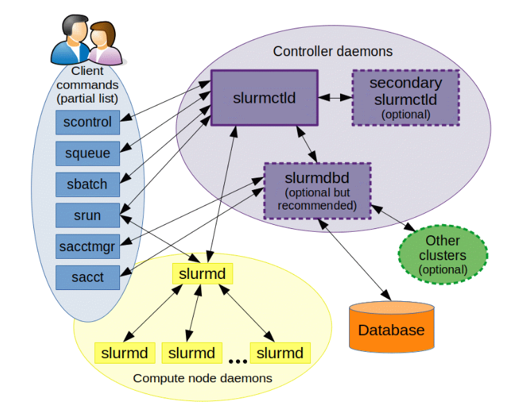

# Cluster & Slurm User Guide

## User Agreement

**Please read the following terms carefully before you proceed any further into this document:**

1. Public server is for public service. Please cherish the public resources and do not use them for other purposes than
   running the required experiments for the course projects.
2. Upload your files in your personal directories (`/nfsmnt/{Studend ID}`. Any file outside the authorized paths will be
   cleaned up without notification and backup. Moreover, subsequent plagiarism will be punished without any mercy or
   excuse if it is caused by someone else accessing your codes at unprotected places.
3. We do not provide any warranty to the safety and availability to any data stored on the cluster. Please backup your
   data constantly and do not upload sensitive personal information. We will not be responsible for any consequences
   caused by data loss and sensitive data leakage.
4. You are not allowed to share your account to others without the permissions of teaching
   staffs. Reselling is forbidden. Once confirmed, your account will be removed.
5. Teaching Staffs have the rights to kill your running processes and remove your account without any notification once
   your behaviors are identified to be disturbing or destructive, including (but not limited to) submitting waste tasks
   to queue, blocking the login node, creating junk files on server and cracking credentials.

**Your login to the server will be regarded as your agreement to the terms above.**

## Notice

The computation resources are limited, and we have more than 300 students (CSC4005 + CSC3150 CUDA assignments only)
using this cluster. Please manage your time properly and get started with your assignments in advance. In principle,
under the circumstances that the server is functioning normally, we will not extend the deadlines of the assignments for
your not being able to retrieve the results from the submission queue in time.

## Contact

If you have any questions while using the cluster or following this user guide, please ask help from:

**Name:** Liu Yuxuan

**Email:** [118010200@link.cuhk.edu.cn](mailto:118010200@link.cuhk.edu.cn)

**Position:** Teaching Assistant

## Overview

The cousr CSC4005 (Parallel Computing) allows students to submit distributed and parallel computation tasks on the
cluster, and Slurm is an open source, fault-tolerant, and highly scalable system that we choose for cluster management
and job scheduling. As a cluster workload manager, Slurm has three key functions.

1. It allocates exclusive and/or non-exclusive access to resources (compute nodes) to users for some duration of time so
   they can perform work.
2. It provides a framework for starting, executing, and monitoring work (normally a parallel job) on the set of
   allocated nodes.
3. It arbitrates contention for resources by managing a queue of pending work.

Most of the content in this user guide is retrieved from the following websites. Have a look if you want to know more
about Slurm.

- [Official Quick Start User Guide](https://slurm.schedmd.com/quickstart.html)
- [Official Slurm User Guide in Chinese](https://docs.slurm.cn/users/)

## Architecture

### Management and Compute Nodes

Slurm consists of a slurmd daemon running on each compute node and a central slurmctld daemon running on a management
node. The slurmd daemons provide fault-tolerant hierarchical communications. In our cluster, we have 28 machines in
total, therefore, 1 management node + 27 compute nodes.


### Cluster Environment

The following information holds for every machine in the cluster.
<html>
<table>
  <tr>
    <th>Item</th>
    <th>Configuration / Version</th>
  </tr>
  <tr>
    <td align="center">System Type</td>
    <td>x86_64</td>
  </tr>
  <tr>
    <td align="center">Opearing System</td>
    <td>CentOS Linux release 7.5.1804</td>
  </tr>
  <tr>
    <td align="center">CPU</td>
    <td>
      Intel(R) Xeon(R) Silver 4210R CPU @ 2.40GHz
      <br/>
      20 Cores, 40 Threads
    </td>
  </tr>
  <tr>
    <td align="center">Memory</td>
    <td>100GB RAM</td>
  </tr>
  <tr>
    <td align="center">GPU</td>
    <td>one Nvidia Quadro RTX 4000 GPU card for each node</td>
  </tr>
  <tr>
    <td align="center">CUDA</td>
    <td>11.7</td>
  </tr>
  <tr>
    <td align="center">GCC</td>
    <td>Red Hat 7.3.1-5</td>
  </tr>
  <tr>
    <td align="center">CMake</td>
    <td>3.14.1</td>
  </tr>
</table>
</html>

### GPU Equipment Details (Nvidia Quadro RTX 4000)

<html>
<table>
  <tr>
    <th>Item</th>
    <th>Configuration / Version</th>
  </tr>
  <tr>
    <td>GPU Memory</td>
    <td>8GB GDDR6</td>
  </tr>
  <tr>
    <td>Memory Interface</td>
    <td>256-bit</td>
    </tr>
    <tr>
        <td>Memory Bandwidth</td>
        <td>Up to 416 GB/s</td>
    </tr>
    <tr>
        <td>NVIDIA CUDA Cores</td>
        <td>2304</td>
    </tr>
    <tr>
        <td>NVIDIA Tensor Cores</td>
        <td>288</td>
    </tr>
    <tr>
        <td>NVIDIA RT Cores</td>
        <td>36</td>
    </tr>
    <tr>
        <td>Single-Precision Performance</td>
        <td>7.1 TFLOPS</td>
    </tr>
    <tr>
        <td>Tensor Performance</td>
        <td>57.0 TFLOPS</td>
    </tr>
    <tr>
        <td>System Interface</td>
        <td>PCI Express 3.0 x 16</td>
    </tr>
</table>
</html>

For more details, please refer to
the [Data Sheet of NVIDIA QUADRO RTX 4000](https://www.nvidia.com/content/dam/en-zz/Solutions/design-visualization/quadro-product-literature/quadro-rtx-4000-datasheet.pdf)

### Slurm Partition and Job

Partitions group nodes into logical sets, and jobs are allocations of resources assigned to a user for a specified
amount of time. Partitions can be considered as job queues, each of which has an assortment of constraints such as job
size limit, job time limit, users permitted to use it, etc. Priority-ordered jobs are allocated nodes within a partition
until the resources (nodes, processors, memory, etc.) within that partition are exhausted. Once a job is assigned a set
of nodes, the user is able to initiate parallel work within the allocation.

There are two partitions in our cluster: **Debug** and **Project**.

<html>
<table>
  <tr>
    <th>Item</th>
    <th>Debug Partition</th>
    <th>Project Partition</th>
  </tr>
  <tr>
    <td align="center">Number of Machines</td>
    <td align="center">9</td>
    <td align="center">18</td>
  </tr>
  <tr>
    <td align="center">Number of logical CPU cores</td>
    <td align="center">360</td>
    <td align="center">720</td>
  </tr>
  <tr>
    <td align="center">Usage</td>
    <td align="center">This partition is for you to debug your program with limited resources but longer time.</td>
    <td align="center">This partition is for you to run benchmark or do experiments with abundant resources but shorter time.</td>
  </tr>
  <tr>
    <td align="center">Max Node Limit</td>
    <td align="center">2</td>
    <td align="center">4</td>
  </tr>
  <tr>
    <td align="center">Max Logical Core Limit Per Node</td>
    <td align="center">40</td>
    <td align="center">40</td>
  </tr>
  <tr>
    <td align="center">Max Time Limit (Minutes)</td>
    <td align="center">20</td>
    <td align="center">10</td>
  </tr>
</table>
</html>

## Get Started

### Login the Cluster

Every student will receive an email about the hostname of the server, the user account (student ID) and a randomly
generated password by default. The default password is very difficult to memorize, so it is recommended that you should
change the password by yourself or set up SSH key authentification for passwordless login (refer to this
article [Instruction on Passwordlessly Connecting to Cluster by Setting Up SSH Key Authentification](./Instruction%20on%20Passwordlessly%20Connecting%20to%20Cluster%20by%20Setting%20Up%20SSH%20Key%20Authentification.md)
for detailed instruction).

After login to the server with your account, you will find yourself at `/nfsmnt/{Your Student ID}`. NFS (Network File
System) is a software that we used for file consistency among all the machines in the cluster. In other words,
everything under `/nfsmnt` will be synchronized and shared in all other machines for distributed/parallel job execution.
Therefore, you should put everything you need under your own directory `/nfsmnt/{Your Student ID}`.

### Submit Jobs for Execution

#### Method-1: Interactive Approach

`salloc` is used to allocate resources for a job in real time. Typically this is used to allocate resources and spawn a
shell. The shell is then used to execute `srun` commands to launch parallel tasks.

`srun` is used to submit a job for execution in real time.

`srun hostname` prints the hostname of the nodes allocated.

Some of the command options for `salloc` and `srun` are listed below. If you want to know more, please
try `salloc --help` or `srun --help`.
<html>
<table>
  <tr>
    <th>Command Options</th>
    <th>Meaning</th>
  </tr>
  <tr>
    <td align="center">-N</td>
    <td>
      number of nodes on which to run
      <br/>
      <strong>Max Limit: 2 for Debug partition and 4 for Project partition</strong> 
    </td>
  </tr>
  <tr>
    <td align="center">-n</td>
    <td>
      number of processors required
      <br/>
      <strong>Max Limit: 2x40=80 for Debug partition and 4x40=160 for Project partition</strong>
    </td>
  </tr>
  <tr>
    <td align="center">-t</td>
    <td>
      time limit (in minutes)
      <br/>
      <strong>Max Limit: 20 for Debug partition and 10 for Project partition</strong>
    </td>
  </tr>
  <tr>
    <td align="center">-p</td>
    <td>
      partition
      <br/>
      <strong>Option: Debug or Project.</strong>  
    </td>
  </tr>
</table>
</html>

**Example**

1. Use `salloc` to allocate 8 processors on 1 node of Debug partition for 5 minutes, and slurm arranges node06 for us.

```bash
[118010200@node21 mpi_demo]$ salloc -N1 -n8 -t5 -p Debug
salloc: Granted job allocation 10692
salloc: Waiting for resource configuration
salloc: Nodes node06 are ready for job
```

2. Execute `srun hostname` and we see that all the processors are indeed from node06.

```bash
[118010200@node21 mpi_demo]$ srun hostname
node06
node06
node06
node06
node06
node06
node06
node06
```

3. Execute a MPI sample program to get expected output.

```bash
[118010200@node21 mpi_demo]$ mpirun -np 4 ./mpi_hello
hello world! Process 3 of 4 on node06
hello world! Process 2 of 4 on node06
hello world! Process 0 of 4 on node06
hello world! Process 1 of 4 on node06
```

4. You can also run CUDA executable file with srun.

```bash
[118010200@node21 CUDA_Demo]$ srun stats
Available CUDA devices - 1

CUDA Device #0
Name                         - Quadro RTX 4000
Total global memory          - 7982 MB 
Total constant memory        - 64 KB 
Shared memory per block      - 48 KB 
Total registers per block    - 65536
Maximum threads per block    - 1024
Clock rate                   - 1545000
Number of multi-processors   - 36
Available CUDA devices - 1
```

#### Method-2: Batch Approach

`sbatch` is used to submit a job script for later execution. The script will typically contain one or more srun commands
to launch parallel tasks. If you use `sbatch` for job submission, you will get all the output recorded in the file that
you assign in the batch script.

**Template for MPI Program**

```bash
#!/bin/bash
#SBATCH --job-name=your_job_name    ## Job name
#SBATCH --output result.out         ## filename of the output
#SBATCH --nodes=1                   ## Run all processes on a single node	
#SBATCH --ntasks=8                  ## number of processes = 20
#SBATCH --cpus-per-task=1           ## Number of CPU cores allocated to each process
#SBATCH --partition=Project         ## Partition name: Project or Debug (Debug is default)

mpirun -np 4 ./psort 10000 ./test_data/10000a.in
```

**Template for CUDA Program**

```bash
#!/bin/bash

#SBATCH --job-name CSC3150CUDADemo  ## Job name
#SBATCH --gres=gpu:1                ## Number of GPUs required for job execution.
#SBATCH --output result.out         ## filename of the output
#SBATCH --partition=Debug           ## the partitions to run in (Debug or Project)
#SBATCH --ntasks=1                  ## number of tasks (analyses) to run
#SBATCH --gpus-per-task=1           ## number of gpus per task
#SBATCH --mem-per-gpu=100M          ## Memory allocated for the job
#SBATCH --time=0-00:02:00           ## time for analysis (day-hour:min:sec)

## Compile the cuda script using the nvcc compiler
## You can compile your codes out of the script and simply srun the executable file.
nvcc -o cuda_exe ./stats.cu

## Run the script
srun cuda_exe
```

**Example**

```bash
[118010200@node21 CUDA_Demo]$ sbatch ./slurm.sh
Submitted batch job 10694
```

#### Cancel Jobs

`scancel` is used to signal jobs that are under the control of Slurm.

**Example**

1. Cancel job 1234 along with all of its steps:

```bash
[118010200@node21 CUDA_Demo]$ scancel 1234
## No Output Expected
```

2. Cancel all pending jobs belonging to user "118010200" in partition "Debug":

```bash
scancel --state=PENDING --user=118010200 --partition=Debug
```

3. Delete all jobs of yourself:

```bash
scancel -u `Student ID`
```

For more examples and detailed command options, please refer
to [Scancel Command Handbook](https://slurm.schedmd.com/scancel.html).

**Notes**

- Deal with the jobs submitted by yourself only. Do not touch anyone else's jobs even if they are pending because of a
  certain limit error. The best way to handle this problem is to let TA know and they will cancel those jobs ASAP.
- TA will cancel invalid jobs daily without notification.

### Check Cluster Information

#### Node States

`sinfo` reports the state of partitions and nodes managed by Slurm. It has a wide variety of filtering, sorting, and
formatting options.

<html>
<table>
  <tr>
    <th>Node State</th>
    <th>Meaning</th>
  </tr>
  <tr>
    <td align="center">alloc</td>
    <td>The node has been allocated and is in use.</td>
  </tr>
  <tr>
    <td align="center">idle</td>
    <td>The node is idle and can be allocated.</td>
  </tr>
  <tr>
    <td align="center">mix</td>
    <td>Part of the node is in use but still has allocatable resources.</td>
  </tr>
  <tr>
    <td align="center">down</td>
    <td>The node is down.</td>
  </tr>
  <tr>
    <td align="center">drain</td>
    <td>No further job will be scheduled on that node, but the currently running jobs will keep running.</td>
  </tr>
  <tr>
    <td colspan=2>
      For more node states, check <a href="https://slurm.schedmd.com/sinfo.html#SECTION_NODE-STATE-CODES">sinfo node state codes</a>)
    </td>
  </tr>
</table>
</html>

**Example**

```bash
[118010200@node21 CUDA_Demo]$ sinfo
PARTITION AVAIL  TIMELIMIT  NODES  STATE NODELIST
Debug*       up      20:00      5  down* node[01-05]
Debug*       up      20:00      4   idle node[06-09]
Project      up      10:00     18   idle node[22-29,31-40]
```

#### Job States

`squeue` reports the state of jobs. It has a wide variety of filtering, sorting, and formatting options. By default, it
reports the running jobs in priority order and then the pending jobs in priority order.

<html>
<table>
  <tr>
    <th>Job State</th>
    <th>Meaning</th>
  </tr>
  <tr>
    <td align="center">R (Running)</td>
    <td>Job currently has an allocation.</td>
  </tr>
  <tr>
    <td align="center">F (Failed)</td>
    <td>Job terminated with non-zero exit code or other failure condition.</td>
  </tr>
  <tr>
    <td align="center">PD (Pending)</td>
    <td>Job is awaiting resource allocation.</td>
  </tr>
  <tr>
    <td align="center">CA (Cancelled)</td>
    <td>Job was explicitly cancelled by the user or system administrator. The job may or may not have been initiated.</td>
  </tr>
  <tr>
    <td colspan=2>
      For more node states, check <a href="https://slurm.schedmd.com/squeue.html#SECTION_JOB-STATE-CODES">squeue job state codes</a>)
    </td>
  </tr>
</table>
</html>

**Example**

```bash
[118010200@node21 CUDA_Demo]$ squeue
    JOBID PARTITION     NAME     USER ST       TIME  NODES NODELIST(REASON)
    4250     Debug odd-even 11801023 PD       0:00      3 (PartitionNodeLimit)
    4251     Debug odd-even 11801023 PD       0:00      3 (PartitionNodeLimit)
    4252     Debug odd-even 11801023 PD       0:00      3 (PartitionNodeLimit)
    ....
```

#### Others

`scontrol` command can be used to report more detailed information about nodes, partitions, jobs, job steps, and
configuration.

`scontrol show partition` command is commonly used to check the configuration details of every partition, including the
detailed resource limits.

**Example**

```bash
[118010200@node21 CUDA_Demo]$ scontrol show partition
PartitionName=Debug
   AllowGroups=ALL AllowAccounts=ALL AllowQos=ALL
   AllocNodes=ALL Default=YES QoS=debug_qos
   DefaultTime=NONE DisableRootJobs=NO ExclusiveUser=NO GraceTime=0 Hidden=NO
   MaxNodes=1 MaxTime=00:20:00 MinNodes=0 LLN=NO MaxCPUsPerNode=40
   Nodes=node[01-09]
   PriorityJobFactor=1 PriorityTier=1 RootOnly=NO ReqResv=NO OverSubscribe=NO
   OverTimeLimit=NONE PreemptMode=OFF
   State=UP TotalCPUs=360 TotalNodes=9 SelectTypeParameters=NONE
   JobDefaults=(null)
   DefMemPerNode=UNLIMITED MaxMemPerCPU=2048
   TRES=cpu=360,mem=360000M,node=9,billing=360

PartitionName=Project
   AllowGroups=ALL AllowAccounts=ALL AllowQos=ALL
   AllocNodes=ALL Default=NO QoS=project_qos
   DefaultTime=NONE DisableRootJobs=NO ExclusiveUser=NO GraceTime=0 Hidden=NO
   MaxNodes=1 MaxTime=00:10:00 MinNodes=0 LLN=NO MaxCPUsPerNode=40
   Nodes=node[22-29,31-40]
   PriorityJobFactor=1 PriorityTier=1 RootOnly=NO ReqResv=NO OverSubscribe=NO
   OverTimeLimit=NONE PreemptMode=OFF
   State=UP TotalCPUs=720 TotalNodes=18 SelectTypeParameters=NONE
   JobDefaults=(null)
   DefMemPerNode=UNLIMITED MaxMemPerNode=UNLIMITED
   TRES=cpu=720,mem=720000M,node=18,billing=720
```

## FAQ

### 1. Why my jobs are always pending and never get executed?

**Answer:**

The following reasons usually indicate problems:

- **PartitionNodeLimit**: The node number ( -N ) is too large, it should not be over 1.
- **PartitionTimeLimit**: The time ( -t ) is too large, it should not be over 20 for Debug partition and 10 for Project
  partition.
- **QOSMaxCpuPerJobLimit**
  The node number ( -N ) is too large, it should not be over 1.
  The task number ( -n ) is too large. It should not be over 8 for Debug partition and 40 for Project Partition.
- **QOSMaxCpuMinutesPerJobLimit**: The node number ( -N ) times the time ( -t ) is too large.

The following reasons are normal, so just wait for a moment:

- **Priority**: There are other tasks waiting before the queue.
- **Resources**: Resources are not enough to be allocated to this job. It's normal if there are other tasks running.

View [squeue documentation](https://slurm.schedmd.com/squeue.html#SECTION_JOB-REASON-CODES) for more reason codes.

## Acknowledge

This documentation would not have been possible without the following contributors:

**Zhu Yifan** (2021-22Fall CSC4005 USTF)

**Wenlong Sun** (2021-22Fall CSC4005 USTF)

**Bokai Xu** (2022-23Fall CSC4005 USTF)

**YangZhixin Luo** (2022-23Fall CSC4005 USTF)

We are still trying to refine this documentation for better user experience. Feel free to open an issue or create a pull
request if you want to make a contribution.
