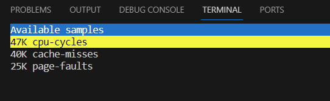
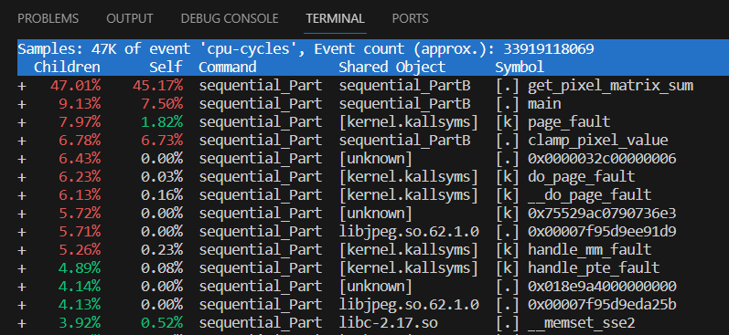
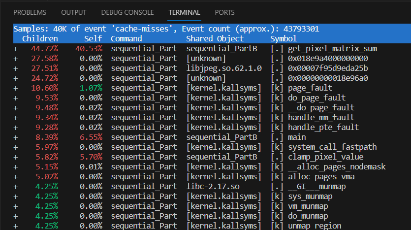
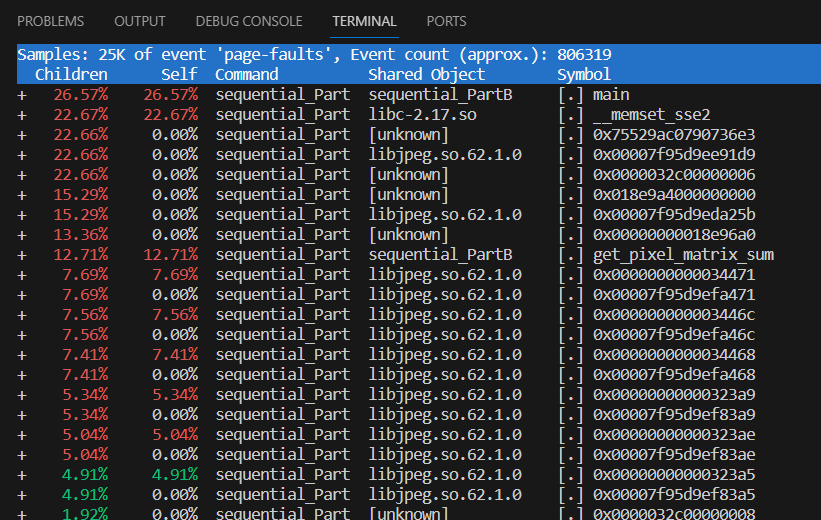
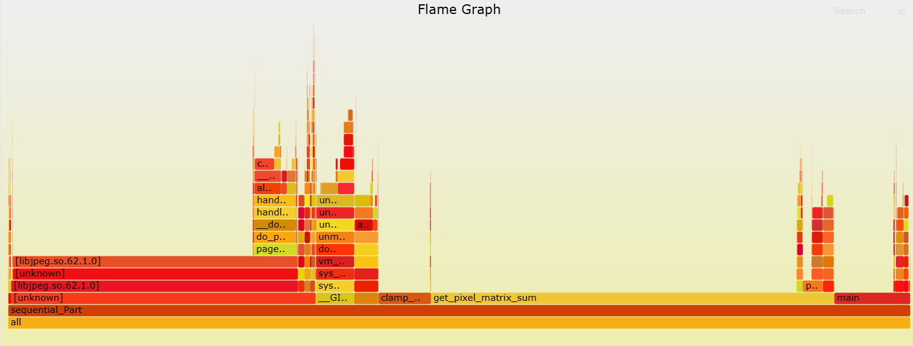
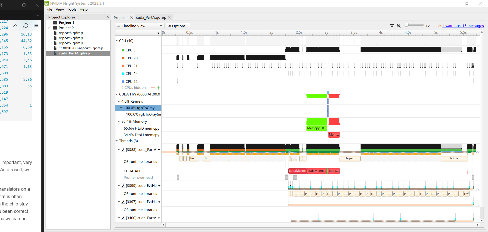

# Instruction on Profiling with perf and nsys

## Author

Mr. Liu Yuxuan (Email: yuxuanliu1@link.cuhk.edu.cn)

## Acknowledge

Special thanks to **Mr. Vincentius Janssen** for his valuable advices to this instruction as well as our course design.

## Prologue

Many students are struggling with the performance of their parallel programs, and exhaust their mind finding ways for optimization. One of the important reasons behind is that they do not have a clear understanding of why their programs are slow, and which parts are the bottleneck. This is why we need to use the profiling tools to profile our programs and see the details in the system during execution, such as cache miss rate, page fault rate, hot function calls, memory traffic, and etc. In the previous semesters, this course has always been focused on the speedup and efficiency of parallel programs using more and mroe computing resources, and pay little attention to program profiling. As instructed by Prof.Hsu, we want to introduce the profiling tools to you this year, and tell you how to use some of the popular tools to profile your programs for in-depth performance analysis. You are required to profile your parallel programs for Project 2, 3, & 4, and include the profiling results in your report. If you still have time and are interested to take one step further, you can try to optimize your programs based on the profiling results you get from the tools.

## Must Read Before All

Understanding everything in the profiling output is not the scope of this course. In your projects, you only need to run the profiling tool and include the results in your report. If you are interested and want to move one step further, you can learn by yourself what is the meaning of each item and how to optimize your parallel programs based on the profiling results. 

## `perf` for CPU Profiling

`perf` is a powerful performance analysis tool in Linux used for profiling and analyzing system and application performance. It is part of the Linux kernel's performance monitoring subsystem and provides a wide range of capabilities for collecting and analyzing performance data. `perf` allows you to collect samples of various performance events, such as CPU cycles, instructions retired, cache misses, and more. By sampling these events, perf provides insights into the performance characteristics of your application or system. It can also trace specific events, such as system calls, function calls, and hardware events, at a very fine-grained level. This helps in analyzing specific code paths and identifying performance bottlenecks.

**Note:** profile CPU programs with perf. Use nsys or nvprof for GPU programs.

### Basic Syntax of `perf`

The syntax of using `perf` is shown as follow:

`perf [PERF-OPTIONS] PERF-COMMAND APPLICATION-TO-PROFILE [APPLICATION-ARGS]`

`perf` supports a number of commands, and you can take a look by executing `perf --help`:

```bash
[118010200@node21 build]# perf --help

 usage: perf [--version] [--help] [OPTIONS] COMMAND [ARGS]

 # ... Only some of the commands are listed due to space limit, try it yourself to get the full list ... 
 The most commonly used perf commands are:
   record          Run a command and record its profile into perf.data
   report          Read perf.data (created by perf record) and display the profile
   sched           Tool to trace/measure scheduler properties (latencies)
   script          Read perf.data (created by perf record) and display trace output
   stat            Run a command and gather performance counter statistics
   test            Runs sanity tests.
   timechart       Tool to visualize total system behavior during a workload
   top             System profiling tool.
   version         display the version of perf binary
   probe           Define new dynamic tracepoints
   trace           strace inspired tool
```

For each command, there will be some options, and you can take a look by executing `perf [PERF-COMMAND] --help`. For example, I want to to use the command 'record' and I need to execute `perf record --help` for more details:

```bash
# ... Part of the output are listed due to space limit, try it yourself to get the full output ... 
PERF-RECORD(1)                                                                                perf Manual                                                                                PERF-RECORD(1)

NAME
       perf-record - Run a command and record its profile into perf.data

SYNOPSIS
       perf record [-e <EVENT> | --event=EVENT] [-a] <command>
       perf record [-e <EVENT> | --event=EVENT] [-a] — <command> [<options>]

DESCRIPTION
       This command runs a command and gathers a performance counter profile from it, into perf.data - without displaying anything.

       This file can then be inspected later on, using perf report.

OPTIONS
       <command>...
           Any command you can specify in a shell.

       -e, --event=
           Select the PMU event. Selection can be:

           ·   a symbolic event name (use perf list to list all events)
```

### How to profile with `perf`

The profiling for `perf` usually consists of two stages. The first stage is to collect/record statistics and export to a file, and the second stage is to analyze the file and give detailed report.

Take our Project 1 for instance, we can profile the sample solution of sequential PartB program as follows:

#### Method-1: Summarized Profiling with `perf stat`

The basic command to do perf recoding is the following. If you want to profile programs on the cluster with slurm, then you simply add the slurm command and options in front of the perf record.

**On Docker Container**
```bash
perf stat -e cpu-cycles,cache-misses,page-faults ./src/cpu/sequential_PartB /path/to/input.jpg /path/to/output.jpg
```

**On the Cluster**
```bash
[root@node21 build]# srun -n 1 --cpus-per-task 1 perf stat -e cpu-cycles,cache-misses,page-faults ./src/cpu/sequential_PartB /nfsmnt/admin/images/20K-RGB.jpg /nfsmnt/admin/images/20K-Smooth.jpg
Input file from: /nfsmnt/admin/images/20K-RGB.jpg
Output file to: /nfsmnt/admin/images/20K-Smooth.jpg
Transformation Complete!
Execution Time: 7210 milliseconds

 Performance counter stats for './src/cpu/sequential_PartB /nfsmnt/admin/images/20K-RGB.jpg /nfsmnt/admin/images/20K-Smooth.jpg':

    33,396,364,062      cpu-cycles                                                  
        43,900,429      cache-misses                                                
           872,673      page-faults                                                 

      12.223834492 seconds time elapsed

      10.226071000 seconds user
       1.331405000 seconds sys
```

##### Multi-Process Profiling with MPI

Since MPI is Multi-Process program, and we need to do profiling on each of the processes with the following command:

**On Docker Container**
```bash
mpirun -np {Num of Processes} perf stat -e cpu-cycles,cache-misses,page-faults ./src/cpu/mpi_PartA /path/to/input.jpg /path/to/output.jpg
```

**On the Cluster**
```bash
srun -np {Num of Processes} perf stat -e cpu-cycles,cache-misses,page-faults ./src/cpu/mpi_PartA /path/to/input.jpg /path/to/output.jpg
```

By executing the command above, you will get several program counter outputs in the terminal, each representing one rank or process in your MPI program. The terminal output may be out-of-order due to the independence between each process. If you think the output is hard to analyze, you don't need to include that in your report.

#### Method-2：Detailed Profiling with `perf record` and `perf report`

The basic command to do perf recoding is the following. If you want to profile programs on the cluster with slurm, then you simply add the slurm command and options in front of the perf record.

**On Docker Container**
```bash
perf record -e cpu-cycles,cache-misses,page-faults -g -o ./perf_sequential_PartB.data /path/to/sequential_PartB /path/to/input.jpeg /path/to/output.jpeg
```

**On the Cluster**
```bash
[118010200@node21 build]$ srun -n 1 --cpus-per-task 1 perf record -e cpu-cycles,cache-misses,page-faults -g -o ./perf_sequential_PartB.data ./src/cpu/sequential_PartB ../images/20K-RGB.jpg ../images/20K-Smooth.jpg
Input file from: ../images/20K-RGB.jpg
Output file to: ../images/20K-Smooth.jpg
Transformation Complete!
Execution Time: 11575 milliseconds
[ perf record: Woken up 46 times to write data ]
[ perf record: Captured and wrote 11.413 MB ./perf_sequential_PartB.data (147354 samples) ]
```

After executing this command, you can find that one file named `perf_sequential_PartB.data` has been created under the current directory. Then, execute the following command to analyze and visualize the perf profiling details in the terminal:

```bash
perf report -i ./perf_sequential_PartB.data
```

After that, you will see a GUI windows in the terminal like the following,



By clicking each of the three items, you can get the detailed profiling results for each aspect:

- **CPU Cycles**

  

- **Cache Misses**


  
- **Page Faults**



##### Multi-Process Profiling with MPI

`perf` can follow spawned child processes, and we can use `perf record` to get one single `perf.data` file containing the profiling information for all the local MPI processes. However, we cannot use `perf record` to profile the individual MPI ranks, and we can only use `perf stat`.

#### Configure `perf` for Customized Profiling

Just now, we have asked `perf` to do profiling on three events:

- CPU Cycles
- Cache Misses
- Page Faults
  
You can configure the events for profiling by yourself for customization. For example, you can list all the events supported by `perf` using command `perf list`:

```bash
[root@node21 build]# perf list
# ... Part of the output are listed due to space limit, try it yourself to get the full output ... 
List of pre-defined events (to be used in -e):

  branch-instructions OR branches                    [Hardware event]
  branch-misses                                      [Hardware event]
  bus-cycles                                         [Hardware event]
  cache-misses                                       [Hardware event]
  cache-references                                   [Hardware event]
  cpu-cycles OR cycles                               [Hardware event]
  instructions                                       [Hardware event]
  ref-cycles                                         [Hardware event]

  alignment-faults                                   [Software event]
  context-switches OR cs                             [Software event]
  cpu-clock                                          [Software event]
  cpu-migrations OR migrations                       [Software event]
  dummy                                              [Software event]
  emulation-faults                                   [Software event]
  major-faults                                       [Software event]
  minor-faults                                       [Software event]
  page-faults OR faults                              [Software event]
  task-clock                                         [Software event]

  L1-dcache-load-misses                              [Hardware cache event]
  L1-dcache-loads                                    [Hardware cache event]
  L1-dcache-stores                                   [Hardware cache event]
  L1-icache-load-misses                              [Hardware cache event]
  LLC-load-misses                                    [Hardware cache event]
```

### [Optional] Virtualization of `perf` Profiling Results

`FlameGraph` is a very popular tool used for visualizing your profiling results with `perf` and some other profiling tools. Please learn from the internet on how to use it if you are interested.

GitHub link: https://github.com/brendangregg/FlameGraph

A demo output SVG may look like the following:




## `nsys` for GPU Profiling

### Basic Syntax of `nsys`

NVIDIA Nsight™ Systems is a system-wide performance analysis tool designed to visualize an application’s algorithms, help you identify the largest opportunities to optimize, and tune to scale efficiently across any quantity or size of CPUs and GPUs, from large servers to our smallest system on a chip (SoC).

Reference: https://developer.nvidia.com/nsight-systems

By executing the `nsys --help` command, we can know the basic syntax of it:

```bash
[root@node21 build]# nsys --help
 usage: nsys [--version] [--help] <command> [<args>] [application] [<application args>]

 The most commonly used nsys commands are:
        profile       Run an application and capture its profile into a QDSTRM file.
        launch        Launch an application ready to be profiled.
        start         Start a profiling session.
        stop          Stop a profiling session and capture its profile into a QDSTRM file.
        cancel        Cancel a profiling session and discard any collected data.
        stats         Generate statistics from an existing QDREP or SQLite file.
        status        Provide current status of CLI or the collection environment.
        shutdown      Disconnect launched processes from the profiler and shutdown the profiler.
        sessions list List active sessions.
        export        Export QDREP file into another format.
        nvprof        Translate nvprof switches to nsys switches and execute collection.

 Use 'nsys --help <command>' for more information about a specific command.

 To run a basic profiling session:   nsys profile ./my-application
 For more details see "Profiling from the CLI" at https://docs.nvidia.com/nsight-systems
```

### Profiling with `nsys`

Take project 1 for instance, suppose we want to profile the CUDA and OpenACC programs in PartA.

**On Docker Container**

```bash
# Profile CUDA Program
nsys profile -t cuda,nvtx,osrt -o ./cuda_PartA.qdrep ./src/gpu/cuda_PartA ../images/20K-RGB.jpg ../images/20K-Smooth.jpg
# Profile OpenACC Program
nsys profile -t cuda,nvtx,osrt,openacc -o ./openacc_PartA.qdrep ./src/gpu/openacc_PartA ../images/20K-RGB.jpg ../images/20K-Smooth.jpg
```

**On the Cluster**

```bash
# Profile CUDA Program
[118010200@node21 build]$ srun -n 1 --gpus 1 nsys profile -t cuda,nvtx,osrt -o ./cuda_PartA.qdrep ./src/gpu/cuda_PartA ../images/20K-RGB.jpg ../images/20K-Smooth.jpg
Collecting data...
Input file from: ../images/20K-RGB.jpg
Output file to: ../images/20K-Smooth.jpg
Transformation Complete!
GPU Execution Time: 27.2686 milliseconds
Processing events...
Saving temporary "/tmp/nsys-report-6eef-aec5-12c1-b9e0.qdstrm" file to disk...

Creating final output files...
Processing [==============================================================100%]
Saved report file to "/tmp/nsys-report-6eef-aec5-12c1-b9e0.qdrep"
Unable to create output file /nfsmnt/118010200/CSC4005-2023Fall/project1/build/./cuda_PartA.qdrep : File exists
Use `--force-overwrite true` to override existing files.
Please manually fetch report file(s) from:
* /tmp/nsys-report-6eef-aec5-12c1-b9e0.qdrep

# Profile OpenACC Program
[118010200@node21 build]$ srun -n 1 --gpus 1 nsys profile -t cuda,nvtx,osrt,openacc -o ./openacc_PartA.qdrep ./src/gpu/openacc_PartA ../images/20K-RGB.jpg ../images/20K-Smooth.jpg
Collecting data...
Input file from: ../images/20K-RGB.jpg
Output file to: ../images/20K-Smooth.jpg
Transformation Complete!
Execution Time: 28 milliseconds
Processing events...
Saving temporary "/tmp/nsys-report-051e-2afc-83f9-5fa8.qdstrm" file to disk...

Creating final output files...
Processing [==============================================================100%]
Saved report file to "/tmp/nsys-report-051e-2afc-83f9-5fa8.qdrep"
Unable to create output file /nfsmnt/118010200/CSC4005-2023Fall/project1/build/./openacc_PartA.qdrep : File exists
Use `--force-overwrite true` to override existing files.
Please manually fetch report file(s) from:
* /tmp/nsys-report-051e-2afc-83f9-5fa8.qdrep
```

After executing this command, new files named 'cuda_PartA.qdrep' and 'openacc_PartA.qdrep' will be created under the currect directory.

### Analysis and Visualization of Profiling Results

#### Method-1: Use `nsys stats`

By executing `perf stats ./cuda_PartA.qdrep`, we can get the profiling result shown as follow:

```bash
[118010200@node21 build]$ nsys stats ./cuda_PartA.qdrep
Using ./cuda_PartA.sqlite for SQL queries.
Running [/opt/nvidia/hpc_sdk/Linux_x86_64/21.7/profilers/Nsight_Systems/target-linux-x64/reports/cudaapisum.py ./cuda_PartA.sqlite]... 

 Time(%)  Total Time (ns)  Num Calls     Average       Minimum      Maximum       StdDev              Name        
 -------  ---------------  ---------  -------------  -----------  -----------  -------------  --------------------
    61.2      573,606,902          2  286,803,451.0  198,034,180  375,572,722  125,538,707.0  cudaMemcpy          
    35.3      330,647,415          2  165,323,707.5      878,832  329,768,583  232,560,173.2  cudaMalloc          
     2.9       27,215,323          1   27,215,323.0   27,215,323   27,215,323            0.0  cudaEventSynchronize
     0.5        4,993,030          2    2,496,515.0    2,480,358    2,512,672       22,849.4  cudaFree            
     0.0           47,541          1       47,541.0       47,541       47,541            0.0  cudaLaunchKernel    
     0.0           23,601          2       11,800.5        5,105       18,496        9,468.9  cudaEventRecord     
     0.0           16,047          2        8,023.5          989       15,058        9,948.3  cudaEventDestroy    
     0.0           15,380          2        7,690.0        1,234       14,146        9,130.2  cudaEventCreate     

Running [/opt/nvidia/hpc_sdk/Linux_x86_64/21.7/profilers/Nsight_Systems/target-linux-x64/reports/gpukernsum.py ./cuda_PartA.sqlite]... 

 Time(%)  Total Time (ns)  Instances    Average      Minimum     Maximum    StdDev                               Name                             
 -------  ---------------  ---------  ------------  ----------  ----------  ------  --------------------------------------------------------------
   100.0       27,216,868          1  27,216,868.0  27,216,868  27,216,868     0.0  rgbToGray(unsigned char const*, unsigned char*, int, int, int)

Running [/opt/nvidia/hpc_sdk/Linux_x86_64/21.7/profilers/Nsight_Systems/target-linux-x64/reports/gpumemtimesum.py ./cuda_PartA.sqlite]... 

 Time(%)  Total Time (ns)  Operations     Average       Minimum      Maximum    StdDev      Operation     
 -------  ---------------  ----------  -------------  -----------  -----------  ------  ------------------
    65.6      374,363,951           1  374,363,951.0  374,363,951  374,363,951     0.0  [CUDA memcpy HtoD]
    34.4      196,509,308           1  196,509,308.0  196,509,308  196,509,308     0.0  [CUDA memcpy DtoH]

Running [/opt/nvidia/hpc_sdk/Linux_x86_64/21.7/profilers/Nsight_Systems/target-linux-x64/reports/gpumemsizesum.py ./cuda_PartA.sqlite]... 

    Total     Operations    Average      Minimum      Maximum    StdDev      Operation     
 -----------  ----------  -----------  -----------  -----------  ------  ------------------
 730,968.750           1  730,968.750  730,968.750  730,968.750   0.000  [CUDA memcpy HtoD]
 243,656.250           1  243,656.250  243,656.250  243,656.250   0.000  [CUDA memcpy DtoH]

Running [/opt/nvidia/hpc_sdk/Linux_x86_64/21.7/profilers/Nsight_Systems/target-linux-x64/reports/osrtsum.py ./cuda_PartA.sqlite]... 

 Time(%)  Total Time (ns)  Num Calls     Average       Minimum      Maximum       StdDev              Name         
 -------  ---------------  ---------  -------------  -----------  -----------  ------------  ----------------------
    41.9    3,305,096,453         45   73,446,587.8        8,652  100,195,928  42,848,485.2  poll                  
    38.1    3,000,738,468          6  500,123,078.0  500,083,144  500,147,087      21,245.9  pthread_cond_timedwait
     7.2      569,878,261      2,074      274,772.5        1,029  151,478,527   5,142,577.8  fread                 
     6.3      494,847,166         26   19,032,583.3        4,400  493,519,991  96,776,857.5  fclose                
     4.9      387,726,500         32   12,116,453.1        1,759  384,983,730  68,040,965.7  fopen                 
     1.1       85,958,946        704      122,100.8        1,006   24,364,616     949,009.2  ioctl                 
     0.4       30,906,022      5,548        5,570.7        1,094       35,451       1,416.9  fwrite                
     0.0        2,673,377         68       39,314.4        3,967      824,782      98,333.2  mmap64                
     0.0        1,996,138         10      199,613.8      103,525      961,502     267,997.4  sem_timedwait         
     0.0          693,278          5      138,655.6        1,104      497,934     216,765.9  fcntl                 
     0.0          682,217          1      682,217.0      682,217      682,217           0.0  pthread_mutex_lock    
     0.0          544,511         86        6,331.5        2,868       20,251       2,396.9  open64                
     0.0          443,737          5       88,747.4       70,893      107,217      14,489.9  pthread_create        
     0.0          338,393         23       14,712.7        2,345       81,224      18,386.7  mmap                  
     0.0          104,567          9       11,618.6        1,000       47,296      16,133.4  fgetc                 
     0.0           85,291          2       42,645.5       10,946       74,345      44,829.9  socket                
     0.0           61,162          6       10,193.7        5,716       23,155       6,600.6  open                  
     0.0           48,677         12        4,056.4        1,336        6,173       1,339.8  write                 
     0.0           47,264          9        5,251.6        2,426       13,944       3,460.1  munmap                
     0.0           45,714         15        3,047.6        1,611        6,571       1,138.9  read                  
     0.0           33,689          1       33,689.0       33,689       33,689           0.0  fgets                 
     0.0           21,317          3        7,105.7        1,857       12,585       5,367.7  fflush                
     0.0           14,547          5        2,909.4        2,485        3,883         556.1  mprotect              
     0.0            6,519          1        6,519.0        6,519        6,519           0.0  connect               
     0.0            6,147          1        6,147.0        6,147        6,147           0.0  pipe2                 
     0.0            2,685          2        1,342.5        1,331        1,354          16.3  pthread_mutex_trylock 
     0.0            1,597          1        1,597.0        1,597        1,597           0.0  bind
```

#### [Optional] Method-2: Use Nsight System GUI Window

If you are interested and want to have a try, you can download the NVIDIA Nsight System on your personal computer for GUI Visualization of the profiling results:

Download here: https://developer.nvidia.com/nsight-systems/get-started

You can open the `qdrep` file generated on the cluster and get a visualization result similar to the following:


