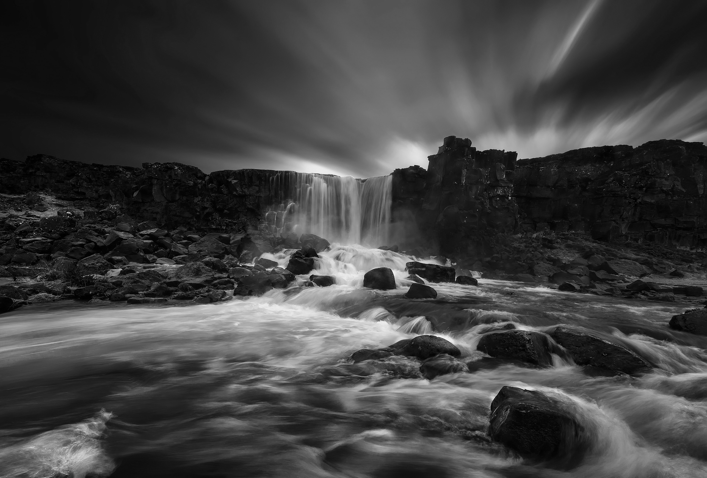
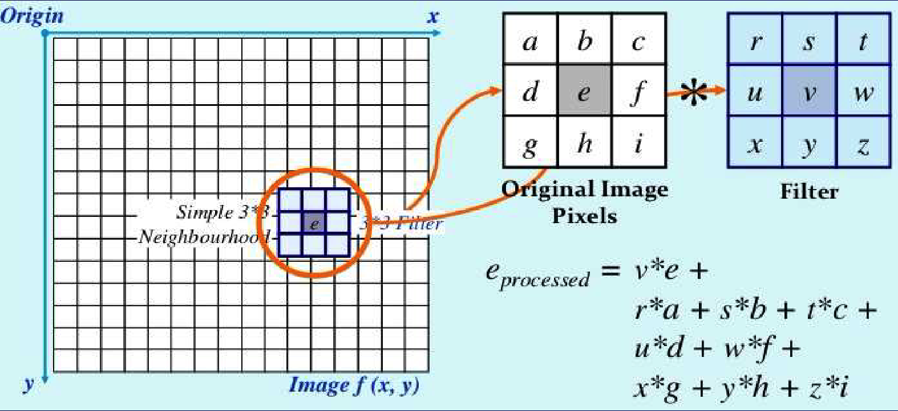
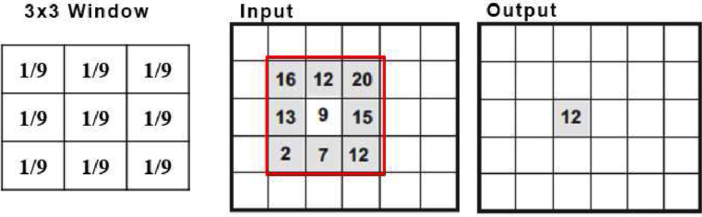
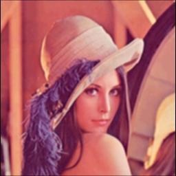
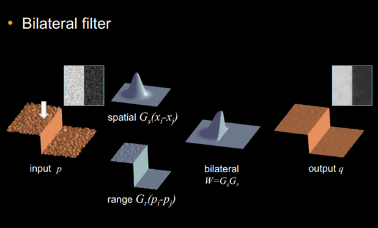

# Project 1: Embarrassingly Parallel Programming

## This project weights 12.5% for your final grade (4 Projects for 50%)

#### Release Date:
September 13th *(Friday)*, 2024 (UTC+8)

#### Deadline (Submit on BlackBoard):
11:59 P.M., September 30th *(Monday)*, 2024 (UTC+8)

#### Suff Responsible for This Project

- TA Liu Yuxuan *(For all languages except Triton)*
- TA Zhang Qihang *(Triton PartB & C)*
- USTF Hou Tianci *(Triton PartA)*

## Prologue

As the first programming project, students are required to solve embarrassingly parallel problem with all parallel programming languages to get an intuitive understanding and hands-on experience on how the simplest parallel programming works. A very popular and representative application of embarrassingly parallel problem is image processing since the computation of each pixel is completely or almost independent with each other.

This programming project consists of three parts (A, B, and C). PartA and PartB have already been implemented, and you can learn how to write each parallel programming language by analyzing those programs. Finally, what you need to do is to implement PartC by the experience and lessons from the previous two parts.

## Part-A: RGB to Grayscale

#### Note: You do not need to modify the codes in this part. Just compile and execute them on the cluster to get the experiment results, and include that in your report.

In this part, students are provided with ready-to-use source programs in a properly configured CMake project. Students need to download the source programs, compile them, and execute them on the cluster to get the experiment results. During the process, they need to have a brief understanding about how each parallel programming model is designed and implemented to do computation in parallel (for example, do computations on multiple data with one instruction, multiple processes with message passing in between, or multiple threads with shared memory).

### Problem Description

#### What is RGB Image?

RGB image can be viewed as three different images(a red scale image, a green scale image and a blue scale image) stacked on top of each other, and when fed into the red, green and blue inputs of a color monitor, it produces a color image on the screen.

**Reference:** https://www.geeksforgeeks.org/matlab-rgb-image-representation/

#### What is Grayscale Image?

A grayscale (or graylevel) image is simply one in which the only colors are shades of gray. The reason for differentiating such images from any other sort of color image is that less information needs to be provided for each pixel. In fact a `gray' color is one in which the red, green and blue components all have equal intensity in RGB space, and so it is only necessary to specify a single intensity value for each pixel, as opposed to the three intensities needed to specify each pixel in a full color image.

**Reference:** https://homepages.inf.ed.ac.uk/rbf/HIPR2/gryimage.htm (Glossary of University of Edinburgh)

#### RGB to Grayscale as a Point Operation

Transferring an image from RGB to grayscale belongs to point operation, which means a function is applied to every pixel in an image or in a selection. The key point is that the function operates only on the pixel’s current value, which makes it completely embarrassingly parallel.

In this project, we use NTSC formula to be the function applied to the RGB image.

```math
Gray = 0.299 * Red + 0.587 * Green + 0.114 * Blue
```

**Reference:** https://support.ptc.com/help/mathcad/r9.0/en/index.html#page/PTC_Mathcad_Help/example_grayscale_and_color_in_images.html

### Example

<div>
    
    
</div>
<p style="font-size: medium;" align="center">
    <strong>Convert Lena JPEG image (256x256) from RGB to Grayscale</strong>
</p>

<div>
    
    <br />
    
</div>
<p style="font-size: medium;" align="center">
    <strong>Convert 4K JPEG image (3840x2599) from RGB to Grayscale</strong>
</p>

## Part-B: Linear Image Filtering (Soften with Equal Weight Filter)

#### Note: You do not need to modify the codes in this part. Just compile and execute them on the cluster to get the experiment results, and include that in your report.

In part B, we move on to parallelize image filtering, which is slightly harder than PartA. This time, the information of each pixel's neighbors are brought into consideration instead of doing computation on the pixel itself. The good news is that: although two adjacent pixels share some neighbors, the read-only property still makes the computation embarrassingly parallel.

### Problem Description

Image Filtering involves applying a function to every pixel in an image or selection but where the function utilizes not only the pixels current value but the value of neighboring pixels. Some of the filtering functions are listed below, and the famous convolutional kernel computation is also a kind of image filtering

- blur
- sharpen
- soften
- distort

Two images below demostrate in detail how the image filtering is done. Basically, we have a filter matrix of given size (3 for example), and we slide that filter matrix across the image to compute the filtered value by element-wise multipling and summation. 

<div>
  
  <p style="font-size: medium;" align="center">
    <strong>How to do image filtering with filter matrix</strong>
  </p>
</div>

<div>
  
  <p style="font-size: medium;" align="center">
    <strong>An example of image filtering of size 3</strong>
  </p>
</div>

In this project, students are required to apply the simplest size-3 low-pass filter with equal weights to smooth the input JPEG image, which is shown below. Note that your program should also work for other filter matrices of size 3 with different weights, that means you should not do specific optimization on the 1 / 9 weight, like replacing multiplication with addition.

<table>
<tr>
    <td align="center">1 / 9</td>
    <td align="center">1 / 9</td>
    <td align="center">1 / 9</td>
</tr>
<tr>
    <td align="center">1 / 9</td>
    <td align="center">1 / 9</td>
    <td align="center">1 / 9</td>
</tr>
<tr>
    <td align="center">1 / 9</td>
    <td align="center">1 / 9</td>
    <td align="center">1 / 9</td>
</tr>
</table>

**Reference:** Lecture-04 slides of course CSC3185: Introduction to Multimedia Systems, CUHKSZ

### Reminders of Implementation
1. The pixels on the boundary of the image do not have all 8 neighbor pixels. For these pixels, you can either use padding (set value as 0 for those missed neighbors) or simply ignore them, which means you can handle the (width - 2) * (height - 2) inner image only. In this way, all the pixels should have all 8 neighbors.
2. Check the correctness of your program with the Lena RGB image. The 4K image has high resolution and the effect of smooth operation is hardly to tell.

### Examples

<div style="display:flex;justify-content:space-around; align-items:center;">
  
  
</div>
<p style="font-size: medium;" align="center">
    <strong>Lena RGB Original and Smooth from left to right</strong>
</p>

## Part-C: Non-Linear Image Filtering (Bilateral Filtering)

In part C, students are asked to implement parallel programs by themselves do embarrassingly parallel bilateral filtering, which is harder than PartA and PartB.

### Problem Description

The Bilateral Filter is a non-linear, edge-preserving smoothing filter that is commonly used in Computer Vision as a simple noise-reduction stage in a pipeline. It calculates the intensity of each output pixel as a weighted average of intensity values from nearby pixels in the input image. Crucially, the weights depend not only on the Euclidean distance between current and neighbor pixels, but also on the radiometric differences (e.g., color intensity differences) between them. The outcome is that edges are preserved while regions with similar intensities are smoothed out.

<div style="display:flex;justify-content:space-around; align-items:center;">
  
</div>
<p style="font-size: medium;" align="center">
    <strong>Lena RGB Original and Smooth from left to right</strong>
</p>

$$ I'(p) = \frac{1}{W_p}\displaystyle\sum_{q\in\Omega}I(p)k_r(||I(q)-I(p)||)k_s(||q-p||)$$

for normalization term W is 

$$ \displaystyle\sum_{q\in\Omega}k_r(||I(q)-I(p)||)k_s(||q-p||) $$

where 
$I$ is the iamge, 
$p$ and $q$ is the pixel position,
$\Omega$ is the kernel
$k_r$ and $k_s$ is the range and spatial kernel, and $k_r(p) = \exp^{-\frac{||p||^2}{2\sigma_r^2}}$, $k_s(p) = \exp^{-\frac{||p||^2}{2\sigma_s^2}}$

**Reference:** 
1. [Triton](https://triton-lang.org/main/index.html)
2. [Bilateral Filter Info](https://docs.nvidia.com/vpi/algo_bilat_filter.html)
3. You may need some api like exp func in [triton api document](https://triton-lang.org/main/python-api/triton.language.html)

### Benchmark Image

The image used for performance evaluation is the 4K JPEG image with around 10 million pixels (3840 x 2599), which has been uploaded to BlackBoard. Please download that image to your docker container or on the cluster. Do not use Lena for your performance evaluation report, because its size is too small to get the parallel speedup. However, you can use Lena to verify the correctness of your programs by identifying the change on the image.

### Requirements & Grading Policy

- **Six parallel programming implementations for PartB (70%)**
  - SIMD (10%)
  - MPI (10%)
  - Pthread (10%)
  - OpenMP (10%)
  - CUDA (10%)
  - OpenACC (10%)
  - Triton *(10%, Optional for undergraduates but compulsotry for postgraduates)*

  You can get full mark for each section as long as your program can compile and execute to get the expected output image by the command you give in the report.

  **Triton PartC is optional for undergraduate students enrolled in CSC4005, but compulsory for postgraduate students enrolled in CSC6115. The other six parallel programming languages (SIMD, MPI, Pthread, OpenMP, CUDA, and OpenACC) are required for both groups of students. The 10% of Triton for undergraduate students will be transfered to the performance part.**

- **Performance of Your Program (20%)**
  Try your best to optimize the performance your parallel programs.If your programs show similar performance to the baseline provided by the teaching stuff, then you can get full mark. Points will be deduted if your parallel programs perform poor while no justification can be found in the report. (Target Peformance will be released soon).
  Some hints to optimize your program are listed below:
  - Try to avoid nested for loop, which often leads to bad parallelism.
  - Change the way that image data or filter matrix are storred for more efficient memory access *(Array-of-Structure / Structure-of-Array)*.
  - Try to avoid expensive arithmetic operations (for example, double-precision floating point division is very expensive, and takes a few dozens of cycles to finish).
  - Partition your data for computation in a proper way for balanced workload for parallelism.

- **One Report in PDF (10%, No Page Limit)**\
  The report does not have to be very long and beautiful to get good grade, but you need to include what you have done and what you have found or learned in this project.
  The following components should be included in the report:
  - How to compile and execute your program to get the expected output image on the cluster?
  - Briefly explain how does each parallel programming model do computation in parallel? What are the similarities and differences between them. Explain these with what you have learned from the lectures (like different types of parallelism, ILP, DLP, TLP, etc).
  - What kinds of optimizations have you tried to speed up your parallel program for PartB, and how do them work?
  - Show the experiment results you get for **PartC Only**, and do some numerical analysis, such as calculating the speedup and efficiency, demonstrated with tables and figures.
  - What have you found from the experiment results? Is there any difference between the experiment resutls of PartC and PartA&B? If so, what may be the reasons?

- **Extra Credits (10%)**\
  If you can use any other methods to achieve a higher speedup than the sample solutions provided by the TA (Baseline peformance to be released).\
  Some possible ways are listed below:
  - A combination of multiple parallel programming models, like combining MPI and OpenMP together.
  - Try to bind program to a specific CPU core for better performance. Refer to: https://slurm.schedmd.com/mc_support.html
  - For GPU programs like CUDA, feel free to change the block size and grid size for better performance.
  - For SIMD, you may parallelize more computation workload.

### The Extra Credit Policy
According to the professor, the extra credits for all projects cannot be added to the final grade or other projects, which determines your rank. The credits are the honor you received from the professor and the teaching stuff, and the professor may help raise you to a higher grade level if you are at the boundary of two grade levels and he think you deserve a better grade with your extra credits. For example, if you are the top students with B+ grade, and get enough extra credits, the professor may raise you to a A-.

### Grading Policy for Late Submission
1. late submission for less than 10 minutes after then DDL is tolerated for possible issues during submission.
2. 10 Points deduction for each day after the DDL (11 minutes later than DDL will be considered as one day, so be careful)
3. Zero point if you submitted your project late for more than two days. 
4. If you have some special reasaons for late submission, please send email to the professor and c.c to the TA responsible for that project.

## How to execute the sample programs in PartA?

### Dependency Installation

#### Libjpeg (In docker container only)

Libjpeg is a tool that we use to manipulate JPEG images. You need to install its packages with yum in your docker container instead of your host OS (Windows or MacOS). This package has been installed on the cluster, so feel free to use it there.

```bash
# Check the ligjpeg packages that are going to be installed
yum list libjpeg*

# Install libjpeg-turbo-devel.x86_64 with yum
yum install libjpeg-turbo-devel.x86_64 -y

# Check that you have installed libjpeg packages correctly
yum list libjpeg*
```

The terminal output for `yum list libjpeg*` after the installation should be as follows:

```bash
[root@cf49d1025aff bin]# yum list libjpeg*
Loaded plugins: fastestmirror, ovl
Loading mirror speeds from cached hostfile
 * base: mirrors.aliyun.com
 * epel: ftp.riken.jp
 * extras: mirrors.aliyun.com
 * updates: mirrors.aliyun.com
Installed Packages
libjpeg-turbo.x86_64                                                                   1.2.90-8.el7                                                            @base
libjpeg-turbo-devel.x86_64                                                             1.2.90-8.el7                                                            @base
Available Packages
libjpeg-turbo.i686                                                                     1.2.90-8.el7                                                            base 
libjpeg-turbo-devel.i686                                                               1.2.90-8.el7                                                            base 
libjpeg-turbo-static.i686                                                              1.2.90-8.el7                                                            base 
libjpeg-turbo-static.x86_64                                                            1.2.90-8.el7                                                            base 
libjpeg-turbo-utils.x86_64                                                             1.2.90-8.el7                                                            base
```

#### Upgrade to CMake3 and GCC-7 (In docker container only)

The programs need `cmake3` and `gcc-7` for compilation and execution. These upgrades have been done on the cluster, which means you can compile and execute the programs directly on the cluster with no problem. If you need to develop programs on your docker container, like for PartB implementation, you need to upgrade your `cmake` and `gcc` by yourself.

```bash
# Install cmake3 with yum
yum install cmake3 -y
cmake3 --version # output should be 3.17.5
# Note: use cmake3 to build the cmake project in your docker container

# Install gcc/g++-7 with yum
yum install -y centos-release-scl*
yum install -y devtoolset-7-gcc*
scl -l
echo "export PATH=/opt/rh/devtoolset-7/root/usr/bin:$PATH" >> ~/.bashrc
source ~/.bashrc
gcc -v # output should be 7.3.1
```

### How to compile the programs?

```bash
cd /path/to/project1
mkdir build && cd build
# Change to -DCMAKE_BUILD_TYPE=Debug for debug build error message logging
# Here, use cmake on the cluster and cmake3 in your docker container
cmake ..
make -j4
```

Compilation with `cmake` may fail in docker container, if so, please compile with `gcc`, `mpic++`, `nvcc` and `pgc++` in the terminal with the correct optimization options.

### How to execute the programs?

#### In Your Docker Container

```bash
cd /path/to/project1/build
# Sequential
./src/cpu/sequential_PartA /path/to/input.jpg /path/to/output.jpg
# MPI
mpirun -np {Num of Processes} ./src/cpu/mpi_PartA /path/to/input.jpg /path/to/output.jpg
# Pthread
./src/cpu/pthread_PartA /path/to/input.jpg /path/to/output.jpg {Num of Threads}
# OpenMP
./src/cpu/openmp_PartA /path/to/input.jpg /path/to/output.jpg
# CUDA
./src/gpu/cuda_PartA /path/to/input.jpg /path/to/output.jpg
# OpenACC
./src/gpu/openacc_PartA /path/to/input.jpg /path/to/output.jpg
```

#### On the Cluster

**Important**: Change the directory of output file in sbatch.sh first

```bash
# Use sbatch
cd /path/to/project1
sbatch ./src/scripts/sbatch_PartA.sh
```

## Performance Evaluation

### PartA: RGB to Grayscale

**Experiment Setup**

- On the cluster, allocated with 32 cores
- Experiment on a 20K JPEG image (19200 x 12995 = 250 million pixels)
- [sbatch file for PartA](src/scripts/sbatch_PartA.sh)
- Performance measured as execution time in milliseconds

| Number of Processes / Cores | Sequential | SIMD (AVX2) | MPI | Pthread | OpenMP | CUDA | OpenACC |
|-----------------------------|------------|-------------|-----|---------|--------|------|---------|
| 1                           | 632        | 416         | 665 | 704     | 475    | 27   | 28      |
| 2                           | N/A        | N/A         | 767 | 638     | 471    | N/A  | N/A     |
| 4                           | N/A        | N/A         | 490 | 358     | 448    | N/A  | N/A     |
| 8                           | N/A        | N/A         | 361 | 178     | 288    | N/A  | N/A     |
| 16                          | N/A        | N/A         | 288 | 116     | 158    | N/A  | N/A     |
| 32                          | N/A        | N/A         | 257 | 62      | 126    | N/A  | N/A     |

<div>
    
</div>
<p style="font-size: medium;" align="center">
    <strong>Performance Evaluation of PartA (numbers refer to execution time in milliseconds)</strong>
</p>

### PartB (Baseline Performance)

If your program can achieve similar performance to the baseline shown below, you can get full mark for your performance part, which weights for 30%.

If your program can achieve better performance (should be obvious, not 1-2%) with reasonable justification in your report, you can get extra credits.

If your program behaves poor performance to the baseline, points will be deducted in performance part.

**Experiment Setup**

- On the cluster
- JPEG image (19200 x 12995 = 250 million pixels)
- [sbatch file here](src/scripts/sbatch_PartB.sh)
- Performance measured as execution time in milliseconds

| Number of Processes / Cores | Sequential | SIMD (AVX2) | MPI  | Pthread | OpenMP | CUDA | OpenACC |
|-----------------------------|------------|-------------|------|---------|--------|------|---------|
| 1                           | 7247       | 4335        | 7324 | 8066    | 8542   | 32   | 23      |
| 2                           | N/A        | N/A         | 7134 | 7229    | 7299   | N/A  | N/A     |
| 4                           | N/A        | N/A         | 3764 | 3836    | 3886   | N/A  | N/A     |
| 8                           | N/A        | N/A         | 2093 | 1835    | 1862   | N/A  | N/A     |
| 16                          | N/A        | N/A         | 1083 | 924     | 1089   | N/A  | N/A     |
| 32                          | N/A        | N/A         | 694  | 535     | 605    | N/A  | N/A     |

<div style="display:flex;justify-content:space-around; align-items:center;">
    
</div>
<p style="font-size: medium;" align="center">
    <strong>Performance Evaluation of PartB (numbers refer to execution time in milliseconds)</strong>
</p>

### PartC (Baseline Performance)

If your program can achieve similar performance (around 5% tolerance) to the baseline shown below, you can get full mark for your performance part, which weights for 20%.

If your program can achieve better performance (should be obvious, not 1-2%) with reasonable justification in your report, you can get extra credits.

If your program behaves poor performance to the baseline, points will be deducted in performance part.

**Experiment Setup**

- On the cluster
- JPEG image (3840 x 2599 ~ 10 million pixels)
- [sbatch file here](src/scripts/sbatch_PartC.sh)
- Performance measured as execution time in milliseconds

| Number of Processes / Cores | Sequential (AOS, -O0) | Sequential (SOA, -O0) | Sequential (-O2) | SIMD (AVX2, -O0) |  SIMD (AVX2, -O2) | MPI (-O2)  | Pthread (-O2) | OpenMP (-O2) | CUDA | OpenACC |
|-----------------------------|-----------------------|-----------------------|------------------|------------------|-------------------|------------|---------------|--------------|------|---------|
| 1                           | 10326                  | 9773                  | 3745            | 3685             | 3674              | 3640       | 3661          | 3654         | 9.6 | 43      |
| 2                           | N/A                   | N/A                   | N/A              | N/A              | N/A               | 2838       | 2804          | 2799         | N/A  | N/A     |
| 4                           | N/A                   | N/A                   | N/A              | N/A              | N/A               | 1428       | 1560          | 1452         | N/A  | N/A     |
| 8                           | N/A                   | N/A                   | N/A              | N/A              | N/A               | 719        | 736           | 756          | N/A  | N/A     |
| 16                          | N/A                   | N/A                   | N/A              | N/A              | N/A               | 361        | 396           | 501          | N/A  | N/A     |
| 32                          | N/A                   | N/A                   | N/A              | N/A              | N/A               | 182        | 217           | 247          | N/A  | N/A     |

## Appendix

### Appendix A: GCC Optimization Options

You can list all the supported optimization options for gcc either by terminal or through online documentations

```bash
# Execute on your docker container or on the cluster
gcc --help=optimizers
```

Online
documentation: [Options That Control Optimization for gcc-7.3](https://gcc.gnu.org/onlinedocs/gcc-7.3.0/gcc/Optimize-Options.html#Optimize-Options)

You can find a lot of useful options to let gcc compiler to do optimization for your program, like doing tree
vectorization.

- **-ftree-vectorize**\
  Perform vectorization on trees. This flag enables -ftree-loop-vectorize and -ftree-slp-vectorize if not explicitly
  specified.

- **-ftree-loop-vectorize**\
  Perform loop vectorization on trees. This flag is enabled by default at -O3 and when -ftree-vectorize is enabled.

- **-ftree-slp-vectorize**\
  Perform basic block vectorization on trees. This flag is enabled by default at -O3 and when -ftree-vectorize is
  enabled.

### Appendix B: Tutorials of the Six Parallel Programing Languages

- **SIMD**
  - https://users.ece.cmu.edu/~franzf/teaching/slides-18-645-simd.pdf
- **MPI**
  - https://mpitutorial.com/tutorials/
- **OpenMP**
  - https://www.openmp.org/resources/tutorials-articles/
  - https://engineering.purdue.edu/~smidkiff/ece563/files/ECE563OpenMPTutorial.pdf
- **Pthread**
  - https://www.cs.cmu.edu/afs/cs/academic/class/15492-f07/www/pthreads.html
  - https://hpc-tutorials.llnl.gov/posix/
- **CUDA**
  - https://newfrontiers.illinois.edu/news-and-events/introduction-to-parallel-programming-with-cuda/
  - https://docs.nvidia.com/cuda/cuda-c-programming-guide/index.html
- **OpenACC**
  - https://ulhpc-tutorials.readthedocs.io/en/latest/gpu/openacc/basics/
  - https://www.openacc.org/sites/default/files/inline-files/OpenACC_Programming_Guide_0_0.pdf
