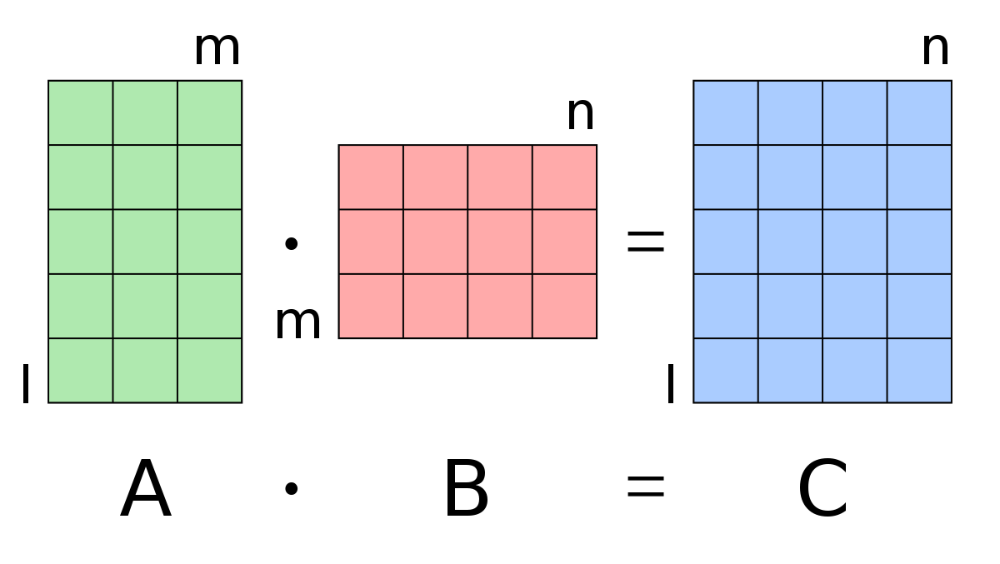
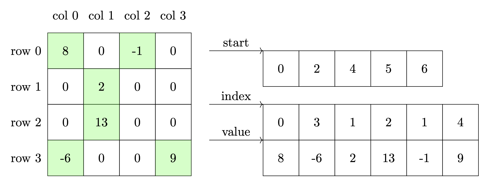
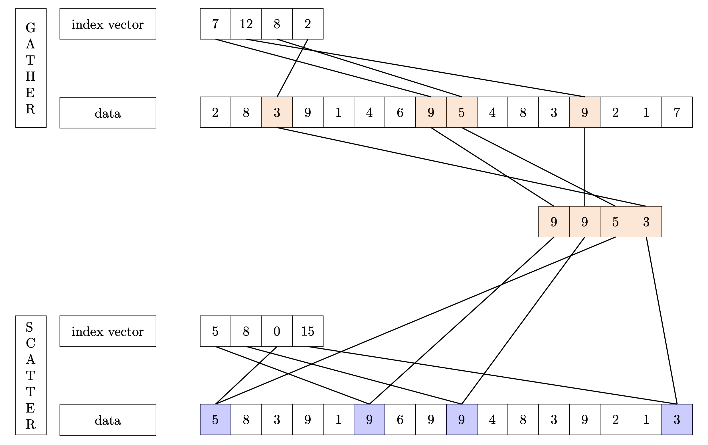

# Project 2: Efficient Dense Matrix Multiplication

## This project weights 12.5% for your final grade (4 Projects for 50%)

### Release Date:

October 11th，2024 (Beijing Time, UTC+08:00)

### Deadline:

11:59 P.M., October 25th, 2024 (Beijing Time, UTC+08:00)

### TA In Charge of This Assignment

**Mr. Seigei Kudria** (sergeikudria@link.cuhk.edu.cn)


## Prologue

For the second programming project, you are tasked with **implementing an efficient dense matrix multiplication** algorithm based on the techniques covered in this course. Matrix multiplication plays an increasingly important role in today's AI landscape, serving as a fundamental component of deep neural networks (DNNs), particularly with the development of large language models (LLMs). Matrix multiplication optimization has been a classic research topic for algorithms for decades, resulting in many classic algorithms tailored to different matrix formats. This project, however, is relatively straightforward, as we focus solely on the most general scenario: **dense matrix multiplication**. The goal of this project is to help you **apply the optimization techniques taught in the course to improve dense matrix multiplication performance**.



At the outset, you will receive a poorly implemented dense matrix multiplication function, and your task is to **optimize it systematically**, considering factors such as **memory locality, SIMD (Single Instruction, Multiple Data), thread-level parallelism, and process-level parallelism** step by step. In your report, you should **document the performance improvements achieved after applying each technique**. Ultimately, you are expected to **submit a program that incorporates all of the aforementioned optimization techniques**, and we will evaluate whether the performance of your implementation meets our expectations.

## Task1: Memory Locality

We have provided you with a basic sequential implementation of dense matrix multiplication as follows.

```C++
  size_t M = matrix1.getRows(), K = matrix1.getCols(), N = matrix2.getCols();

  Matrix result(M, N);

  for (size_t i = 0; i < M; ++i) {
      for (size_t j = 0; j < N; ++j) {
          for (size_t k = 0; k < K; ++k) {
              result[i][j] += matrix1[i][k] * matrix2[k][j];
          }
      }
  }
```

This implementation suffers from poor performance due to its suboptimal memory locality. In Task 1, you are required to:

1. In your report, analyze why our provided implementation of dense matrix multiplication exhibits such poor performance.
2. Complete the `Matrix matrix_multiply_locality(const Matrix& matrix1, const Matrix& matrix2)` function in `src/locality.cpp`. Your goal is to optimize our implementation by enhancing memory locality.
    1. Note: You **cannot** apply any parallel techniques at this stage.
    2. Hint: Here are some methods you may try to increase memory locality and avoid cache misses:
        1. Change the order of the triple loop
        2. Apply tiled matrix multiplication
3. In your report, demonstrate the performance improvement achieved after implementing your changes.

## Task2: Data-Level Parallelism

After completing Task 1, you should already have a relatively efficient sequential implementation for dense matrix multiplication. However, this level of efficiency is not sufficient. In fact, Single Instruction, Multiple Data (SIMD) techniques have been widely employed in many high-performance matrix multiplication libraries. Therefore, in Task 2, you are tasked with:

1. Completing the `Matrix matrix_multiply_simd(const Matrix& matrix1, const Matrix& matrix2)` function in `src/simd.cpp`. Your goal is to further enhance your implementation of dense matrix multiplication by applying SIMD techniques.
    1. **Note: you should build upon the work from Task 1**.
2. In your report, showcasing the performance improvement achieved after implementing these changes

## Task3: Thread-Level Parallelism

Now is the time to introduce thread-level parallelism to your implementation to further enhance the efficiency of dense matrix multiplication. We recommend utilizing OpenMP for its user-friendly approach. Therefore, in Task 3, you have the following objectives:

1. Complete the `Matrix matrix_multiply_openmp(const Matrix& matrix1, const Matrix& matrix2)` function in `src/openmp.cpp`. Your goal is to expand the application of thread-level parallelism to your implementation using OpenMP.
    1. **Note: You should build upon the work from Task 2.**
2. In your experiments, vary the thread num from 1, 2, 4, 8, 16 to 32, and observe the performance improvements.
3. In your report, showcase the performance improvements achieved after implementing these changes.

## Task4: Process-Level Parallelism

Finally, you are tasked with introducing process-level parallelism to your dense matrix multiplication implementation to further enhance efficiency, utilizing MPI. Therefore, in Task 4, you should:

1. Complete the `Matrix matrix_multiply_mpi(const Matrix& matrix1, const Matrix& matrix2)` function in `mpi.cpp` to extend the application of process-level parallelism to your implementation using MPI. Additionally, you need to edit the `main` function to incorporate other MPI-specific logic, such as process communication.
    1. **Note: You should build upon the work from Task 3.**
2. In your experiments, keep the total thread num fixed at 32 (where `process num` * `thread num per process` = 32), but adjust the process num and thread num per process accordingly (1 x 32, 2 x 16, 4 x 8, 8 x 4, 16 x 2, 32 x 1). Observe the performance changes.
3. In your report, demonstrate the performance improvements (if any) achieved after implementing these changes.

### Extended Experiment for MPI using 64 Threads on Multiple Nodes [Not Graded]

You may wonder why message passing is needed in our project since we run programs in one single node, and your concern is correct.
Basically, message passing is unable to give you performance as good ad shared memory programs like Pthread and OpenMP. However, what if we want more threads than one node can provide? That is what the MPI is good at, that is, scalability, which is very important for parallel programming and high-performance computing.

In your assignment, you need to do an extra experiment on Task 4 using 64 threads in total (where `process num` * `thread num per process` = 64). We have reconfigured the cluster so that everyone can allocate at most 2 nodes in Debug partition, and 4 nodes in Project partition. Please cherish the computing resources and release them once you finished the computation, especially on the DDL day.

**Note:** the 64-thread performance is not graded, so you just need to run the experiment and include the experiment results in your report.

## Task5: Sparse Matrix Multiplication (extra credits for undergraduate students)


Sometimes matrices $\mathbf{A} \in \mathbb{R}^{m \times k}$, $\mathbf{B} \in \mathbb{R}^{k \times n}$ contain only a very few nonzero entries (say, the magnitude of $O(m + n)$), and numbers $m$, $n$ are large (say, millions). In this setting, it is impractical (and sometimes simply impossible) to store matrices as vectors of vectors. Instead, one should keep only the list of their nonzero elements with corresponding positions in matrices. One of ways to do this is _compressed-sparse column format_. It uses three one-dimensional arrays: one for non-zero values, one for the row indices of those values, and another for the cumulative count of non-zero values in each column (see figure, arrays are depicted as value, index and start respectively).




There are many ways to multiply two matrices given in a CSC format. We consider a columnwise computation of a matrix multiplication $\mathbf{C} = \mathbf{AB}$ as follows: for columns $j = 1, \ldots, n$ we have $\mathbf{C}_{:,j} = \sum \limits_{i = 1}^k \mathbf{A}_{:, i} B_{ij}$. To utilize the sparsity of both $\mathbf{A}$, $\mathbf{B}$ we use a scatter-gather procedure, applied to sparse vectors $\mathbf{A}_{:, i} B_{ij}$:

1. In the beginning, we initialize a dense column $\mathbf{w}$ of dimension $m$;
2. For each $i = 1, \ldots, k$ we scatter a sparse vector $\mathbf{A}_{:, i} B_{ij}$ into $\mathbf{x}$;
3. In the end, we gather the result into a sparse vector (another column of $\mathbf{C}$).

Procedure of gathering and scattering are depicted at the figure, for more details you can look up the book of Timothy A. Davis "Direct Methods for Sparse Linear Systems", chapter 2.



In this task, you are supposed to develop a parallelized version of an algorithm described in this section. You are allowed to utilize any techniques from sections above, additionally, you are allowed to transfer some code functionality into an auxiliary function, written by yourself. Optimized performance is not required; reaching the baseline performance is enough to get a full (extra) credit for this part.

## Extra Credits: GPU Matrix Multiplication

Nowadays, GPUs are widely applied in AI areas to accelerate matrix multiplication. Therefore, we have chosen GPU Matrix Multiplication as the bonus task for Project 2.

For the bonus task, you can choose either CUDA or OpenACC to implement GPU Matrix Multiplication by completing `src/gpu/cuda.cu` or `src/gpu/openacc.cpp`. We haven't provided a code skeleton for this task because there are many optimization techniques available for GPU Matrix Multiplication, and you have the freedom to choose your approach. We expect to see a significant performance improvement compared to the CPU version.

As part of the bonus task, you should submit detailed instructions in your report on how to compile and execute your program. Additionally, you are required to showcase and analyze the performance improvements compared to the best CPU implementation.

## Requirements & Grading Policy

- **Six parallel programming implementations for PartB (60%)**
    - Task1: Memory Locality (12%; 15% for UG)
    - Task2: Data-Level Parallelism (12%; 15% for UG)
    - Task3: Thread-Level Parallelism (12%; 15% for UG)
    - Task4: Process-Level Parallelism (12%; 15% for UG)
    - Task5: Sparse Matrix Multiplication (12%; extra credit for UG)

  Your programs should be able to compile & execute to get the computation result. Besides, to judge the correctness of your program, we will prepare 5 matrix testcases, you can get full mark if your programs pass all of them. Each failure of testcase will cause a 3-point deduction on that Task.

- **Performance of Your Program (20%)**

  Try your best to do optimization on your parallel programs for higher speedup. If your programs shows similar performance to the baseline performance, then you can get full mark for this part. Points will be deduted if your parallel programs perform poor while no justification can be found in the report. The 20% point will be divided into 4 x 5% for each of the four tasks.

- **One Report in PDF (20%, No Page Limit)**
    - **Regular Report As Project-1 (10%)**

      The report does not have to be very long and beautiful to help you get good grade, but you need to include what you have done and what you have learned in this project. The following components should be included in the report:
        - How to compile and execute your program to get the expected output on the cluster.
        - Briefly explain how does each parallel programming model do computation in parallel?
        - What kinds of optimizations have you tried to speed up your parallel program, and how does them work?
        - Show the experiment results you get, and do some numerical analysis, such as calculating the speedup and efficiency, demonstrated with tables and figures.
        - What have you found from the experiment results?
    - **Profiling Results & Analysis with `perf` (10%)**

      Please follow the [Instruction on Profiling with perf and nsys](https://github.com/tonyyxliu/CSC4005-2023Fall/blob/main/docs/Instruction%20on%20Profiling%20with%20perf%20and%20nsys.md) to profile all of your parallel programs for the four tasks with `perf`, and do some analysis on the profiling results before & after the implementation or optimization. For example, for Task 1, you are asked to optimize the memory access pattern, decreasing cache misses and page faults for better efficiency. You can use the profiling results from `perf` to do quantitative analysis that how many cache misses or page faults can be reduced with your optimization. Always keep your mind open, and try different profiling metrics in `perf` and see if you can find any interesting thing during experiment.

      **Note:** The raw profiling results may be very long. Please extract some of the useful items to show in your report, and remember to carry all the raw profiling results for your programs when you submit your project on BB.

- **Extra Credits (10%)**
    - CUDA  Implementation (10%) or OpenACC Implementation (10%)
    - If you can pass all the testcases we provide, you can get the points. Optimized performance is not required. Choose one from CUDA and OpenACC to implement is enough to get full mark for extra credits.
    - Any interesting discoveries or discussions regarding the experiment results.

### The Extra Credit Policy
According to the professor, the extra credits in project 1 cannot be added to other projects to make them full mark. The credits are the honor you received from the professor and the teaching stuff, and the professor may help raise you to a higher grade level if you are at the boundary of two grade levels and he think you deserve a better grade with your extra credits. For example, if you are the top students with B+ grade, and get enough extra credits, the professor may raise you to A- grade.

### Grading Policy for Performance
Note that the performance weights for 30% in total and each program accounts for 5%. Each program is graded independently so that even a highly optimized MPI program cannot save a poor OpenMP program.

Suppose the execution time of your program is T, then

# For Task 1 & 2 & 3 & 4 & 5
- Case-1: T <= 125% * Baseline                  --> 5%
- Case-2: T in [125% - 150%] of Baseline        --> 2.5%
- Case-3: T > 150% * Baseline                   --> 0%

**Note:** This time, for task 3 & 4 & 5 (OpenMP and MPI), only the 32 thread performance will be graded to make life easier.

### Grading Policy for Late Submission
1. late submission for less than 10 minutes after then DDL is tolerated for possible issues during submission.
2. 10 Points deduction for each day after the DDL (11 minutes late will be considered as one day, so be careful)
3. Zero point if you submitted your project late for more than two days
   If you have some special reasons for late submission, please send email to the professor and c.c to TA Liu Yuxuan.

### File Structure to Submit on BlackBoard

```bash
118010200.zip
|-
|--- 118010200.pdf      # Report
|-
|--- src_sparse/        # Where your source codes lie in
|--- src/               # Where your source codes lie in
|--- matrices_sparse    # Sparse matrix testcases
|--- matrices/          # Dense matrix testcases 
|--- CMakeLists.txt     # Root CMakeLists.txt
|-
|--- profiling/         # Where your perf profiling raw results lie in
```

## How to Execute the Program

### Data Set

We have provided 4 groups of matrices for your testing under `/path/to/project2/matrices`:

| Group |   Size    |   MatrixA   |   MatrixB   |
| :---: | :-------: | :---------: | :---------: |
|   1   |    4*4    | matrix1.txt | matrix2.txt |
|   2   |  128*128  | matrix3.txt | matrix4.txt |
|   3   | 1024*1024 | matrix5.txt | matrix6.txt |
|   4   | 2048*2048 | matrix7.txt | matrix8.txt |

Only matrices within the same group can be multiplied together. We recommend using Group 1 matrices to verify the correctness of your matrix multiplication implementation. For performance testing, it's better to use matrices from Groups 3 and 4 to clearly observe the performance improvements.

### Compilation

```bash
cd /path/to/project2
mkdir build && cd build
# Change to -DCMAKE_BUILD_TYPE=Debug for debug build error message logging
# Here, use cmake on the cluster and cmake3 in your docker container
cmake ..
make -j4
```

Compilation with `cmake` may fail in docker container, if so, please compile with `gcc`, `mpic++`, `nvcc` and `pgc++` in the terminal with the correct optimization options.

### Local Execution

```bash
cd /path/to/project2/build
# Naive
./src/naive /path/to/matrixA /path/to/matrixB /path/to/multiply_result
# Memory Locality
./src/locality /path/to/matrixA /path/to/matrixB /path/to/multiply_result
# SIMD
./src/simd /path/to/matrixA /path/to/matrixB /path/to/multiply_result
# OpenMP
./src/openmp $thread_num /path/to/matrixA /path/to/matrixB /path/to/multiply_result
# MPI
mpirun -np $process_num ./src/mpi $thread_num_per_process /path/to/matrixA /path/to/matrixB /path/to/multiply_result
```

### Job Submission

**Important**: Change the directory of output file in `sbatch.sh` first, and you can also change the matrix files for different testing.

```bash
# Use sbatch
cd /path/to/project2
sbatch ./src/sbatch.sh
```

## Performance Baseline

### Experiment Setup

Dense matrices:
- On the cluster, allocated with 32 cores
- Matrices 1024 * 1024 with `matrix5.txt` and `matrix6.txt`
- Matrices 2048 * 2048 with `matrix7.txt` and `matrix8.txt`
- Use `src/sbatch.sh`

|                         Methods                          | Matrices 1024*1024 | Matrices 2048*2048 |
| :------------------------------------------------------: | :----------------: | :----------------: |
|                          Naive                           |      8165 ms       |      89250 ms      |
|                     Memory Locality                      |       776 ms       |      6509 ms       |
|                  SIMD + Memory Locality                  |       273 ms       |      2720 ms       |
|       OpenMP + SIMD + Memory Locality (32 threads)       |        41ms        |       214 ms       |
| MPI + OpenMP + SIMD + Memory Locality (total 32 threads) |       33 ms        |       184 ms       |

Sparse matrices:
- On the cluster, allocated with 32 cores
- Matrices 10k * 10k with `matrix1.txt` and `matrix2.txt`
- Matrices 50k * 50k with `matrix3.txt` and `matrix4.txt`
- Matrices 200k * 200k with `matrix5.txt` and `matrix6.txt`
- Use `src_sparse/sbatch.sh`

|                         Methods                          | Matrices 10k*10k | Matrices 50k*50k | Matrices 200k*200k |
|:--------------------------------------------------------:|:----------------:|:----------------:|:------------------:|
|                          Naive                           |     4300 ms      |     22330 ms     |      90700 ms      |                
|                       Parallelized                       |      680 ms      |     2570 ms      |      13280 ms      |
