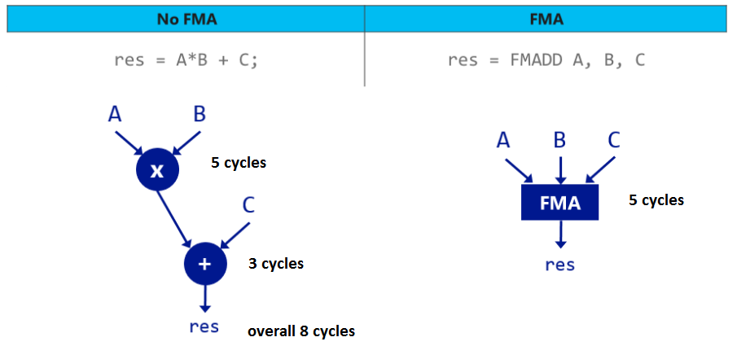
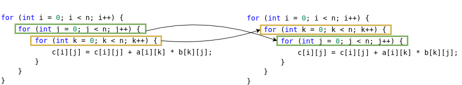
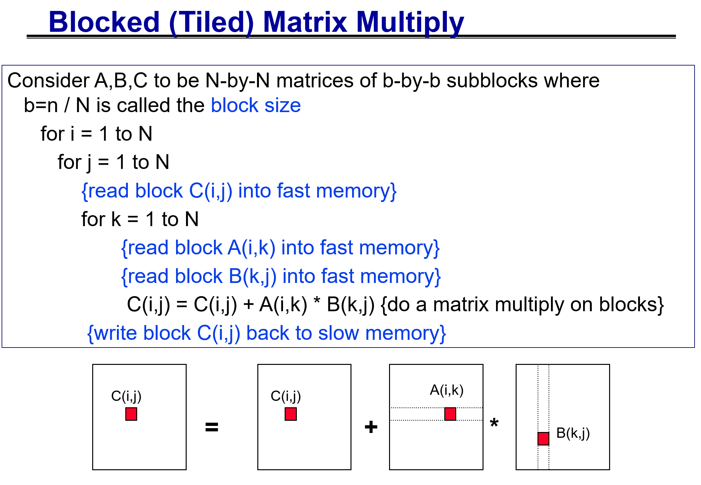

# Project 2: Efficient Dense Matrix Multiplication

## This project weights 12.5% for your final grade (4 Projects for 50%)

### Release Date:

Tuesday, October 14th，2025 (Beijing Time, UTC+08:00)

### Deadline:

11:59 P.M., Friday, October 31st, 2025 (Beijing Time, UTC+08:00)

### TA/USTF In Charge of This Assignment

**Mr. Yuxuan LIU** (mailto:yuxuanliu1@link.cuhk.edu.cn)
**Mr. Mengkang LI** (mailto:mengkangli@link.cuhk.edu.cn)

## Prologue

Matrix multiplication plays an increasingly important role in today's AI landscape, serving as a fundamental component of deep neural networks (DNNs), particularly with the development of large language models (LLMs). Matrix multiplication optimization has been a classic research topic for algorithms for decades, resulting in many classic algorithms tailored to different matrix formats.

For the second programming project, you get started with a **naive triple-loop dense matrix multiplication program**. You need to **improve the performance of the naive program step by step** based on the techniques covered in this course.

This project focus mainly on the most general scenario: **dense matrix multiplication** since dealing with **sparse matrices** is not straight-forward. If you want to have a try with the sparse one, you could do that for extra credits.


At the outset, you will receive a poorly implemented dense matrix multiplication function, and your task is to **optimize it systematically**, considering factors such as **memory locality, SIMD (Single Instruction, Multiple Data), thread-level parallelism, and process-level parallelism** step by step. In your report, you should **document the performance improvements achieved after applying each technique**. Ultimately, you are expected to **submit a program that incorporates all of the aforementioned optimization techniques**, and we will evaluate whether the performance of your implementation meets our expectations.

## !!! MUST-READ !!!: Each task is built upon the previous ones. For example, tasks starting from task 2 can utilize FMA in task 1. Tasks starting from task 3 can utilize constant pointers in task 2. So on so forth.

## How to Execute the Program

### Data Set

We have provided 4 groups of matrices for your testing under `/path/to/project2/matrices`:

| Group |   Size    |   MatrixA   |   MatrixB   | Data Type |
| :---: | :-------: | :---------: | :---------: | :-------: |
|   1   |    4*4    | matrix1.txt | matrix2.txt | double    |
|   2   |  128*128  | matrix3.txt | matrix4.txt | double    |
|   3   | 1024*1024 | matrix5.txt | matrix6.txt | double    |
|   4   | 2048*2048 | matrix7.txt | matrix8.txt | double    |

Only matrices within the same group can be multiplied together. The ground truth result matrices are also avaialble for correctness check. For performance testing, it's better to use matrices from Groups 3 and 4 to clearly observe the performance improvements.

### Compilation

```bash
cd /path/to/project2
mkdir build && cd build
# Change to -DCMAKE_BUILD_TYPE=Debug for debug build error message logging
cmake ..
make -j8
```

Compilation with `cmake` may fail in docker container, if so, please compile with `gcc`, `mpic++`, `nvcc` and `pgc++` in the terminal with the correct optimization options.

### Execution

```bash
###################
## salloc + srun ##
###################

salloc -N1 -n32 -t10 -pDebug

cd /path/to/project2/build
# Naive
salloc -n 1 --cpus-per-task 1 ./src/naive /path/to/matrixA /path/to/matrixB
# Task 1: FMA
salloc -n 1 --cpus-per-task 1 ./src/fma_restrict /path/to/matrixA /path/to/matrixB
salloc -n 1 --cpus-per-task 1 ./src/fma_standalone_var /path/to/matrixA /path/to/matrixB
# Task 2: Const Ptr Decl
salloc -n 1 --cpus-per-task 1 ./src/const_ptr_decl /path/to/matrixA /path/to/matrixB
# Task 3: Memory Locality
salloc -n 1 --cpus-per-task 1 ./src/transpose /path/to/matrixA /path/to/matrixB
salloc -n 1 --cpus-per-task 1 ./src/loop_interchange /path/to/matrixA /path/to/matrixB
# Task 4: Tiling
salloc -n 1 --cpus-per-task 1 ./src/tiling_transpose $BLOCK_SIZE /path/to/matrixA /path/to/matrixB
salloc -n 1 --cpus-per-task 1 ./src/tiling_loop_interchange $BLOCK_SIZE /path/to/matrixA /path/to/matrixB
# Task 5: GCC auto Vectorization 
salloc -n 1 --cpus-per-task 1 ./src/autovec $BLOCK_SIZE /path/to/matrixA /path/to/matrixB
# Task 6: OpenMP
salloc -n 1 --cpus-per-task $thread_num ./src/openmp $thread_num $BLOCK_SIZE  /path/to/matrixA /path/to/matrixB

############
## sbatch ##
############
cd /path/to/project2
sbatch ./src/scripts/sbatch_matmul5x6.sh    # For matrix5.txt and matrix6.txt
sbatch ./src/scripts/sbatch_matmul7x8.sh    # For matrix7.txt and matrix8.txt
```

## Starting Point: Naive Triple-Loop

The naive program performs the matmul computation using a triple-for-loop, in the order of 'i-j-k'. It strictly follows the computation strategy of matmul, but it turns out its performance is extremely poor. In the following sections, you need to locate various programming issues what make it run slowly and fix them one by one.

- See the complete naive source code in `src/naive.cpp`

```C++
Matrix matrix_multiply_naive(const Matrix& matrix1, const Matrix& matrix2)
{
    // Matrix size check ignored here...
    size_t M = matrix1.getRows(), K = matrix1.getCols(), N = matrix2.getCols();
    Matrix result(M, N);
    for (size_t i = 0; i < M; ++i)
    {
        for (size_t j = 0; j < N; ++j)
        {
            for (size_t k = 0; k < K; ++k)
            {
                result(i, j) += matrix1(i, k) * matrix2(k, j);
            }
        }
    }
    return result;
}
```

## Task 1: Fused Multiply and Add (FMA)

It is clear to see that we are execution a single instruction `result(i, j) = matrix1(i, k) * matrix2(k, j) + result(i, j)`. This instruction is made of a double-precision multiplication and an addition. Therefore, why not aceelerate it by replacing `fmul` and `fadd` instructions with a single `vfmadd` instruction, taking advantage of the modern hardware ISA support. 



FMA compilation in GCC can be turned on by specifying `-mfma -ffp-contract=fast`. However, simply compiling the naive program with these options cannot produce FMA-optimized code for you. This is because the compiler is not sure whether the array pointer indexing of the `result` matrix is safe or not. There may be aliases of this pointer somewhere else that also modifies the value. Therefore, to convince the compiler to enable FMA, we need to do some minor changes to tell the compiler that the `result` array pointer is safe, and it will not be changed elsewhere.

There are mainly two ways to do it. Have a try with both ways to see which one gives you better performance.
1. **Declare the `MAT_DATATYPE*` of `result` as `__restrict__`**
  - **TODO: `src/task1_fma_restrict_ptr.cpp`**
  - This type qualifier means the `MAT_DATATYPE*` of `result` can only be accessed through this pointer, noway from elsewhere.
  - See official explanation in https://www.gnu.org/software/c-intro-and-ref/manual/html_node/restrict-Pointers.html

2. **Define a standalone variable to store results temporarily**
  - **TODO: src/task1_fma_standalone_var.cpp**
  - With a local variable, the compiler knows easily that it is impossible to be changed elsewhere, and it can enable FMA with great confidence. 

#### FMA Verification

You can check whether FMA instructions take place in two ways:
1. **Manually Generate Assembly Code**
  - `g++ -O2 -mfma -ffp-contract=fast /src/task1_fma_restrict.cpp /src/matrix.cpp -S`
  - `cat ./task1_fma_restrict.s | grep vfma`
  - Or you can dive into the assembly file to see a basic block like the following

  ```s
  .LEHB9:
	call	_ZNK6MatrixclEmm@PLT
	vmovsd	(%rax), %xmm0
	movq	%rbp, %rdx
	movq	%rbx, %rsi
	movq	%r14, %rdi
	vmovsd	%xmm0, 16(%rsp)
	call	_ZNK6MatrixclEmm@PLT
	vmovsd	8(%rsp), %xmm1
	vmovsd	16(%rsp), %xmm0
	addq	$1, %rbx
	vfmadd132sd	(%rax), %xmm1, %xmm0
	vmovsd	%xmm0, 8(%rsp)
	cmpq	%rbx, %r15
	jne	.L505
  ```

2. **Analyze Your Code in Online Compiler Explorer**
  - Link: https://godbolt.org/
  - Sample code: /src/compiler-explorer/example-fma.cpp
  - Your can customize your compiler, using GCC, Clang, or other compilers to see various IR formats, like assembly or LLVM IR.

## Task 2: Declaring Constant Pointers

Aprt from `result(i, j)`, getting elements from `matrix1` and `matrix2` also blocks the compiler from optimization. They should be really fast since both are read-only. Although we have overrided `operator()(size_t i, size_t j) const`, there is still a non-const version. To give the compiler more faith in memory optimization, we can manually declare the two pointers as constant.

1. **Using `const MAT_DATATYPE* const mat1_data` to retrieve elements from matrix 1**
  - **TODO: `src/task2_const_ptr_decl.cpp`**
  - Hint: utilize `Matrix::getDataConst()` method in `matrix.cpp/hpp`
  - Compiler-friendly pointer. Memory optimization enabled. 

## Task 3: Improve Cache Locality

The most critical issue of the naive program is that referencing `matrix2[k, j]` within the k loop is not contiguous. Addresses of two consecutive iterations have a stride of a whole row, which definitely cannot be stored in the same cache line. This results in poor cache efficiency and a large amount of cache references. 

There are mainly two ways to solve the problem. Try them both to see which one gives you better performance.

1. **Matrix Transoposition**
- **TODO: `src/task3_transpose.cpp`**
- The simplest idea to avoid non-contiguous memory access in `matrix2(k, j)` is to get its matrix transpose. The computation then becomes `result(i, j) += matrix1(i, k) * matrix2_transpose(j, k)`. By introducing a small amount of workload, the memory accesses are all contiguous.

2. **Loop Interchange**
- **TODO: src/task3_loop_interchange.cpp**
- The naive 'i-j-k' triple loop is straight-forward for the matmul computation, but not cache-efficient. Interchanging loop orders greatly improve cache efficiency  while not affecting the correctness.



## Task 4: Tiling

Although Task 3 has improved the cache locality, itering the whole matrix size leads to a lot of afterward cache revisit. For example, each row in a `2048 x 2048` double precision matrix takes `2048 * 8 / 64 = 256` cache lines to store, occupying `256 * 64B = 16KiB`.  All these cache lines need to be stored in L1-d cache for the best cache efficiency, but the L1-d cache size in our cluster is only `64KiB`, meaning 1/4 capacity to store a single row. It takes too much cache space.

We are then wondering: is there a approach that we can perform matmul on a much smaller scale so that the smaller matrix is loaded only when it is required. In this way, we do not need to always store the whole row in fast L1-d cache. Yes, we do have such a approach, and it is called tiling.

The key idea of tiling is dividing the large matrix into subblocks (e.g., `matrix1[i ~ i + BLOCK_SIZE][k ~ k + BLOCK_SIZE]`). Matmul can then be achieved by treating these subblocks as a single element. The `result` block is computed as multiplying the two blocks in `matrix1` and `matrix2`. The pesudo codes are as follow. In this way, we only need to store `3 x BLOCK_SIZE * BLOCK_SIZE * sizeof(double)` content in L1d-cache.

As for which algorithm to use for subblock matmul, try both of them in Task 3.

- **TODO: `src/task4_tiling_loop_interchange.cpp`**
  - use `matrix_multiply_loop_interchange` for subblock matmul
- **TODO: `src/task4_tiling_transpose.cpp`**
  - use `matrix_multiply_transpose` for subblock matmul

```cpp
// Allocate Subblock Matrices
Matrix mat1_block_ik(BLOCK_SIZE, BLOCK_SIZE);
Matrix mat2_block_kj(BLOCK_SIZE, BLOCK_SIZE);
Matrix result_block_ij(BLOCK_SIZE, BLOCK_SIZE);

for (i = 0 ~ M; i += BLOCK_SIZE)
{
  for (j = 0 ~ N; j += BLOCK_SIZE)
  {
    for (k = 0 ~ K; k += block_size)
    {
      // Subblock Loading
      LoadBlock(mat1_block_ik);
      LoadBlock(mat2_block_kj);
      // Subblock Matmul
      result_block_ij += matmul(mat1_block_ik, mat2_block_kj);
    }
    // Subblock Storing
    StoreBlock(result_block_ij);
  }
}
```



*Slide from UC.Berkeley CS267 Lecture 2: MemHierarchyMatMul by Prof. James Demmel, Year 2005*

## Task 5: GCC Auto-Vectorization

Another optimization we can do in single-threaded matmul is to vectorize the computation to make it run faster *(data-level parallelism)*. You need to decide where to put GCC pragmas for vectorization. Thanks to our previous effort of `__restrict__` and constant pointer declaration, the compiler can now enable auto vectorization with great confidence.

- **TODO: `src/task5_autovec.cpp`**
  - Possible pragmas to use:
    - `#pragma GCC ivdep`
    - `#pragma GCC vector always`
    - `#pragma GCC unroll X`, X means the number of iterations to unroll
  - Check whether your auto vectorization takes effect by turning on `-fopt-info-vec` flag. You should be able to see outputs similar to the following.

  ```bash
  # Vectorization in Task 5 Main Loop
  /nfsmnt/118010200/CUHKSZ-CSC4005-Internal/project2/src/task5_auto_vec.cpp:46:30: optimized: loop vectorized using 32 byte vectors
  /nfsmnt/118010200/CUHKSZ-CSC4005-Internal/project2/src/task5_auto_vec.cpp:46:30: optimized: loop vectorized using 16 byte vectors

  # Vectorization in Task 6 Main Loop
  /nfsmnt/118010200/CUHKSZ-CSC4005-Internal/project2/src/task6_openmp.cpp:43:30: optimized: loop vectorized using 32 byte vectors
  /nfsmnt/118010200/CUHKSZ-CSC4005-Internal/project2/src/task6_openmp.cpp:43:30: optimized: loop vectorized using 16 byte vectors
  /nfsmnt/118010200/CUHKSZ-CSC4005-Internal/project2/src/task6_openmp.cpp:72:9: optimized: basic block part vectorized using 32 byte vectors

  # Vectorization in utility functions
  /nfsmnt/118010200/CUHKSZ-CSC4005-Internal/project2/src/matrix.cpp:19:44: optimized: basic block part vectorized using 32 byte vectors
  /nfsmnt/118010200/CUHKSZ-CSC4005-Internal/project2/src/matrix.cpp:40:14: optimized: basic block part vectorized using 32 byte vectors
  /nfsmnt/118010200/CUHKSZ-CSC4005-Internal/project2/src/matrix.cpp:123:26: optimized: loop vectorized using 32 byte vectors
  /nfsmnt/118010200/CUHKSZ-CSC4005-Internal/project2/src/matrix.cpp:123:26: optimized: loop vectorized using 16 byte vectors
  /nfsmnt/118010200/CUHKSZ-CSC4005-Internal/project2/src/matrix.cpp:168:10: optimized: basic block part vectorized using 32 byte vectors
  /nfsmnt/118010200/CUHKSZ-CSC4005-Internal/project2/src/matrix.cpp:171:16: optimized: basic block part vectorized using 32 byte vectors
  /nfsmnt/118010200/CUHKSZ-CSC4005-Internal/project2/src/matrix.cpp:186:10: optimized: basic block part vectorized using 32 byte vectors
  /nfsmnt/118010200/CUHKSZ-CSC4005-Internal/project2/src/matrix.cpp:190:16: optimized: basic block part vectorized using 32 byte vectors
  ```

## Task 6: OpenMP Multi-Threading

After getting an optimized single-threaded program, we can further accelerate it by multi-threading (*thread-level parallelism*). OpenMP is one of the best candidates to use since we just need to do some minor changes, like adding some omp pragmas, to make it parallel.

- **TODO: `src/task6_openmp.cpp`**
  - Consider how to organize omp pragmas.
  - Which data needs to be shared or being private?
  - Where to put omp pragmas and autovec pragmas to make them collaborate.
  - Analyze the performance with different number of threads (from 1 to 32).

## Extra Credits (EC in short)

Optimizing matrix multiplication is a topic that never comes to an end. A little more speed-up of it could change a lot. Feel free to explore other optimization techniques to accelerate matmul. Here, we list some options for you:

### EC-Option-1: SIMD Matrix Multiplication

Compared to replying on GCC to do auto vectorization, another way to exploit *data-level parallelism* is to manually control the vector registers and instructions by writing intrinsics. Note that we are dealing with double-precision elements.

### EC-Option-2: Thread-Level Parallelism with MPI

You may write a MPI program to launch multiple process, while each process hosting several threads. Be careul with the data transfer.

### EC-Option-3: GPU Matrix Multiplication

Nowadays, GPUs are widely applied in AI areas to accelerate matrix multiplication. Therefore, we have chosen GPU Matrix Multiplication as the bonus task for Project 2.

For the bonus task, you can choose either *CUDA* or *OpenACC* or *Triton* to implement GPU Matrix Multiplication by completing `src/gpu/cuda.cu` or `src/gpu/openacc.cpp` or `src/triton.py`. **For tiled matmul, we strongly recomment you to have a try with Triton.** We haven't provided a code skeleton for this task because there are many optimization techniques available for GPU Matrix Multiplication, and you have the freedom to choose your approach. You can also ask GPT to generate a code skeleton for you as a starting point. We expect to see a significant performance improvement compared to the CPU version.

As part of the bonus task, you should submit detailed instructions in your report on how to compile and execute your program. Additionally, you are required to showcase and analyze the performance improvements compared to the best CPU implementation.

### EC-Option-4: Sparse Matrix Multiplication

Sometimes matrices $\mathbf{A} \in \mathbb{R}^{m \times k}$, $\mathbf{B} \in \mathbb{R}^{k \times n}$ contain only a very few nonzero entries (say, the magnitude of $O(m + n)$), and numbers $m$, $n$ are large (say, millions). In this setting, it is impractical (and sometimes simply impossible) to store matrices as vectors of vectors. Instead, one should keep only the list of their nonzero elements with corresponding positions in matrices. One of ways to do this is _compressed-sparse column format_ (**CSC format**). It uses three one-dimensional arrays: one for non-zero values, one for the row indices of those values, and another for the cumulative count of non-zero values in each column (see figure, arrays are depicted as value, index and start respectively).


There are many ways to multiply two matrices given in a CSC format. We consider a columnwise computation of a matrix multiplication $\mathbf{C} = \mathbf{AB}$ as follows: for columns $j = 1, \ldots, n$ we have $\mathbf{C}_{:,j} = \sum \limits_{i = 1}^k \mathbf{A}_{:, i} B_{ij}$. To utilize the sparsity of both $\mathbf{A}$, $\mathbf{B}$ we use a scatter-gather procedure, applied to sparse vectors $\mathbf{A}_{:, i} B_{ij}$:

1. In the beginning, we initialize a dense column $\mathbf{w}$ of dimension $m$;
2. For each $i = 1, \ldots, k$ we scatter a sparse vector $\mathbf{A}_{:, i} B_{ij}$ into $\mathbf{x}$;
3. In the end, we gather the result into a sparse vector (another column of $\mathbf{C}$).

Procedure of gathering and scattering are depicted at the figure, for more details you can look up the book of Timothy A. Davis "Direct Methods for Sparse Linear Systems", chapter 2.


In this task, you are supposed to develop a parallelized version of an algorithm described in this section. You are allowed to utilize any techniques from sections above, additionally, you are allowed to transfer some code functionality into an auxiliary function, written by yourself. Optimized performance is not required; reaching the baseline performance is enough to get a full (extra) credit for this part.

## Requirements & Grading Policy

- **Six parallel programming implementations for PartB (40%)**
    - Task #1: FMA (5%)
    - Task #2: Const Ptr Declaration (5%)
    - Task #3: Improve Memory Locality
      - #3.1: By Matrix Transposition (5%)
      - #3.2: By Loop Re-Ordering (5%)
    - Task #4: Tiling (10%)
    - Task #5: Auto Vectorization (5%)
    - Task #6: OpenMP Multi-Threading (5%)

  Your programs should be able to compile & execute to get the computation result. Besides, to judge the correctness of your program, we will prepare 5 matrix testcases, you can get full mark if your programs pass all of them. Each failure of testcase will cause a 3-point deduction on that Task.

- **Performance of Your Program (40%)**
    - Task #1: FMA (5%)
    - Task #2: Const Ptr Declaration (5%)
    - Task #3: Improve Memory Locality
      - #3.1: By Matrix Transposition (5%)
      - #3.2: By Loop Re-Ordering (5%)
    - Task #4: Tiling (10%)
    - Task #5: Auto Vectorization (5%)
    - Task #6: OpenMP Multi-Threading (5%)

  Try your best to do optimization on your parallel programs for higher speedup. If your programs shows similar performance to the baseline performance, then you can get full mark for this part. Points will be deduted if your parallel programs perform poor while no justification can be found in the report. The 20% point will be divided evenly into for each of the three tasks.

- **One Report in PDF (20%, No Page Limit)**
    - **Regular Report (10%)**

      The report does not have to be very long and beautiful to help you get good grade, but you need to include what you have done and what you have learned in this project. The following components should be included in the report:
        - How to compile and execute your program to get the expected output on the cluster.
        - Briefly explain how does each parallel programming model do computation in parallel?
        - What kinds of optimizations have you tried to speed up your parallel program, and how does them work?
        - Show the experiment results you get, and do some numerical analysis, such as calculating the speedup and efficiency, demonstrated with tables and figures.
        - What have you found from the experiment results?

    - **Profiling Results & Analysis (10%)**
      - Profiling tools you may need
        - `perf`
        - `valgrind --tool=cachegrind`
        - `nsys`

      Please follow the [Instruction on Profiling with perf and nsys](https://github.com/tonyyxliu/CSC4005-2023Fall/blob/main/docs/Instruction%20on%20Profiling%20with%20perf%20and%20nsys.md) to profile all of your parallel programs for the four tasks with `perf`, and do some analysis on the profiling results before & after the implementation or optimization. For example, for Task 1, you are asked to optimize the memory access pattern, decreasing cache misses and page faults for better efficiency. You can use the profiling results from `perf` to do quantitative analysis that how many cache misses or page faults can be reduced with your optimization. Always keep your mind open, and try different profiling metrics in `perf` and see if you can find any interesting thing during experiment.

      **Note:** The raw profiling results may be very long. Please extract some of the useful items to show in your report, and remember to carry all the raw profiling results for your programs when you submit your project on BB.

- **Extra Credits (10%)**
    - See section 'Extra Credits'. Grading of this part is gonna be subjective to the TA.

### The Extra Credit Policy
According to the professor, the extra credits in project 1 cannot be added to other projects to make them full mark. The credits are the honor you received from the professor and the teaching stuff, and the professor may help raise you to a higher grade level if you are at the boundary of two grade levels and he think you deserve a better grade with your extra credits. For example, if you are the top students with B+ grade, and get enough extra credits, the professor may raise you to A- grade.

## Grading Policy for Performance
Note that the performance weights for 30% in total and each program accounts for 5%. Each program is graded independently.

Suppose the execution time of your program is T, then

### For Task 1 ~ 6
- Case-1: T <= 125% * Baseline                  --> 5%
- Case-2: T in [125% - 150%] of Baseline        --> 2.5%
- Case-3: T > 150% * Baseline                   --> 0%

**Note:** This time, for task 3 (OpenMP), only the 32 thread performance will be graded to make life easier.

### Grading Policy for Late Submission
1. late submission for less than 10 minutes after then DDL is tolerated for possible issues during submission.
2. 10 Points deduction for each day after the DDL (11 minutes late will be considered as one day, so be careful)
3. Zero point if you submitted your project late for more than two days
   If you have some special reasons for late submission, please send email to the professor and c.c to TA Liu Yuxuan.

### File Structure to Submit on BlackBoard

```bash
118010200.zip
|-
|--- 118010200.pdf      # Report
|-
|--- bonus/             # Where your source codes lie in
|--- src/               # Where your source codes lie in
|--- matrices/          # Dense matrix testcases
|--- CMakeLists.txt     # Root CMakeLists.txt
|-
|--- profiling/         # Where your perf profiling raw results lie in
```

## Performance Baseline

### Experiment Setup

Dense matrices:
- On the cluster, allocated with 32 cores
- Matrices 1024 * 1024 with `matrix5.txt` and `matrix6.txt`
- Matrices 2048 * 2048 with `matrix7.txt` and `matrix8.txt`
- Use `src/scripts/sbatch_matmul5x6.sh` and `src/scripts/sbatch_matmul7x8.sh`

|                         Methods                          | Matrices 1024*1024  | Matrices 2048*2048 |
| :------------------------------------------------------: | :-----------------: | :----------------: |
|   Naive                                                  |      13664 ms       |      265377 ms     |
|   Task 1.1: \_\_restrict\_\_ ptr                         |      11319 ms       |      190779 ms     |
|   Task 1.2: standalone var                               |       9181 ms       |      201627 ms     |
|   Task 2: const ptr decl                                 |       4356 ms       |       82298 ms     |
|   Task 3.1: Transposition                                |       1510 ms       |       13493 ms     |
|   Task 3.2: Loop Interchange                             |       676  ms       |        9146 ms     |
|   Task 4.1: Tiling + Transposition (best BLOCK_SIZE)     |       909  ms       |        7456 ms     |
|   Task 4.2: Tiling + Loop Interchange (best BLOCK_SIZE)  |       610  ms       |        5004 ms     |
|   Task 5: Auto Vectorization (best BLOCK_SIZE)           |       358  ms       |        2899 ms     |
|   Task 6: OpenMP Multi-Threading (32 threads)            |        66  ms       |         254 ms     |

<!-- ### Extra Credits Result (For reference)
Sparse matrices:
- On the cluster, allocated with 32 cores
- Matrices 10k * 10k with `matrix1.txt` and `matrix2.txt`
- Matrices 50k * 50k with `matrix3.txt` and `matrix4.txt`
- Matrices 200k * 200k with `matrix5.txt` and `matrix6.txt`

|                         Methods                          | Matrices 10k*10k | Matrices 50k*50k | Matrices 200k*200k |
|:--------------------------------------------------------:|:----------------:|:----------------:|:------------------:|
|                          Naive                           |     4300 ms      |     22330 ms     |      90700 ms      |                
|                       Parallelized                       |      680 ms      |     2570 ms      |      13280 ms      |

Data Parallelism

|                         Methods                          | Matrices 1024*1024 | Matrices 2048*2048 |
| :------------------------------------------------------: | :----------------: | :----------------: |
|          Auto Vectorization  + Memory Locality           |       236 ms       |      2400 ms       |
|       SIMD + Memory Locality                             |        217 ms        |       1843 ms       |
| CUDA  | 31 ms | 209 ms | 
 -->
