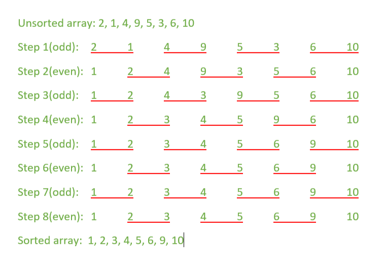

# Project 3: Distributed/Parallel Sorting Algorithms with MPI

## This project weights 12.5% for your final grade (4 Projects for 50%)

### Release Date:

October 31st，2023 (Beijing Time, UTC+08:00)

### Deadline:

11:59 P.M., November 17th, 2023 (Beijing Time, UTC+08:00)

### Teaching Stuff In Charge of This Assignment

TA Mr. Yang Yufan(yufanyang1@link.cuhk.edu.cn)

USTF Miss. Zhang Na (nazhang@link.cuhk.edu.cn)

### Teaching Stuff Who Will Grade This Assignment

TA Mr. Liu Yuxuan (yuxuanliu1@link.cuhk.edu.cn)

## Introduction

Sorting algorithms are of great importance in computer science. In data structure and algorithm courses, we have learned about various sorting algorithms. However, have you ever considered making these algorithms run in parallel on multi-core CPUs or even distributing them in a cluster? In fact, distributed and parallel sorting algorithms are more challenging than the projects we have completed for two main reasons. Firstly, it is not that easy to divide the entire task into different threads or processes. Secondly, the work of different threads or processes is no longer independent, which means that they must communicate with each other to synchronize their states and ensure that the algorithms run correctly.

In this project, we have prepared three classic sorting algorithms for you, some of which you may be very familiar with:

1. **Quick Sort**
2. **Bucket Sort**
3. **Odd-Even Sort**

You are required to implement either the thread-level parallel or process-level parallel version of these algorithms. Get started and do your best!

## Task 1: Process-Level Parallel Quick Sort with MPI

Quick Sort is a highly efficient and widely used sorting algorithm in computer science. It is known for its fast average-case performance and is often the sorting algorithm of choice in many applications. Quick Sort operates on the principle of a divide-and-conquer strategy, where it repeatedly divides the unsorted list into two sublists: elements smaller than a chosen pivot and elements larger than the pivot. The algorithm sorts these sublists and combines them to create the final sorted list.

Here's a step-by-step explanation of how Quick Sort works:

1. **Pivot Selection**: The algorithm selects a pivot element from the unsorted list. The choice of the pivot can significantly affect the algorithm's efficiency, and various methods are used to select the pivot, such as selecting the first, last, middle, or a random element from the list.
2. **Partitioning**: The list is then partitioned into two sublists: elements less than the pivot and elements greater than the pivot. This is done by comparing each element in the list with the pivot and moving elements to the appropriate sublist.
3. **Recursion**: Quick Sort is applied recursively to both sublists, which means that the algorithm is called on the sublists created in the previous step. This process continues until the sublists are small enough to be considered sorted.
4. **Combining**: Once the recursion reaches small enough sublists, no further action is needed. The sorted sublists are then combined to form the final sorted list.


```c++
int partition(std::vector<int> &vec, int low, int high) {
    int pivot = vec[high];
    int i = low - 1;

    for (int j = low; j < high; j++) {
        if (vec[j] <= pivot) {
            i++;
            std::swap(vec[i], vec[j]);
        }
    }

    std::swap(vec[i + 1], vec[high]);
    return i + 1;
}

void quickSort(std::vector<int> &vec, int low, int high) {
    if (low < high) {
        int pivotIndex = partition(vec, low, high);
        quickSort(vec, low, pivotIndex - 1);
        quickSort(vec, pivotIndex + 1, high);
    }
}
```

The sequential version of quick sort has been provided in `src/quicksort/sequential.cpp`, and your task is to implement a **process-level parallel quick sort** using **MPI** in `src/quicksort/mpi.cpp`. 

To make life easier, we simply partition the data into several blocks and send each data block to one MPI process, which performs sequential quick-sort inside to make that data block in order. After all the processes finish sorting their data, a sequential merge is done to construct the final sorted list for output.

Note that this task actually has nothing to do with making the quick sort computation in parallel. We simply call the sequential quick-sort in each MPI process for efficient sorting and do a sequential reduction.

### Hints:

1. The sequential merging is referred as the [k-way merge problem](https://en.wikipedia.org/wiki/K-way_merge_algorithm), and you should think about how to merge multiple ordered lists into one list. One way may be merging from bottom to top (for example, 8 to 4, 4 to 2, 2 to 1). Another way may take advantage of some specific data structure (heap, for example) to do merging for all the ordered lists together, as long as you can know which list has the smallest/highest value as its head element.

### Topics for Extra Credits and Deeper Invectigation:

1. It is possible to make the quick-sort computation part go in parallel to get extra speedup on top of the basic implementation in Task 1. The solution is to do dynamic thread creation to deal with the recursive function call during sorting. To implement this dynamic thread creation, you can use either Pthread, std::thread, or simply OpenMP. Please see the [Extra Credits](#extra-credits-thread-level-parallel-merge-sort-with-dynamic-thread-creation) section for more details.
2. Another optimization may be making the sequential merging (the [k-way merge problem](https://en.wikipedia.org/wiki/K-way_merge_algorithm)) go in parallel. See if you can think of any solution for this.

## Task 2: Process-Level Parallel Bucket Sort

Bucket Sort is a sorting algorithm that falls under the category of distribution sort algorithms. It is particularly useful when sorting a large number of elements with known or limited range values, such as integers or floating-point numbers. The primary idea behind Bucket Sort is to distribute elements into a finite number of buckets and then sort the individual buckets using another sorting algorithm, typically insertion sort. Once the buckets are sorted, their contents are concatenated to obtain the final sorted result.

Here's a step-by-step explanation of how Bucket Sort works:

1. **Bucket Creation**: Create a fixed number of buckets (or containers) based on the range of input values. The range of values should be known or bounded in advance. For example, if you are sorting a list of integers between 1 and 100, you can create 100 buckets.
2. **Distribution**: Iterate through the input list and place each element into its corresponding bucket based on a mapping function. This mapping function should distribute elements uniformly among the buckets.
3. **Sort Each Bucket**: After all elements are distributed into the buckets, sort each individual bucket. This step can use any sorting algorithm, but typically, insertion sort is chosen because it's simple and efficient for small lists.
4. **Concatenation**: Finally, concatenate the sorted buckets in order to obtain the fully sorted list. The order of concatenation depends on the order of the buckets, and it typically follows the order of the buckets' indices.


```c++
void insertionSort(std::vector<int>& bucket) {
    for (int i = 1; i < bucket.size(); ++i) {
        int key = bucket[i];
        int j = i - 1;

        while (j >= 0 && bucket[j] > key) {
            bucket[j + 1] = bucket[j];
            j--;
        }

        bucket[j + 1] = key;
    }
}

void bucketSort(std::vector<int>& vec, int num_buckets) {
    int max_val = *std::max_element(vec.begin(), vec.end());
    int min_val = *std::min_element(vec.begin(), vec.end());

    int range = max_val - min_val + 1;
    int small_bucket_size = range / num_buckets;
    int large_bucket_size = small_bucket_size + 1;
    int large_bucket_num = range - small_bucket_size * num_buckets;
    int boundary = large_bucket_num * large_bucket_size;

    std::vector<std::vector<int>> buckets(num_buckets);
    // Pre-allocate space to avoid re-allocation
    for (std::vector<int>& bucket : buckets) {
        bucket.reserve(large_bucket_num);
    }

    // Place each element in the appropriate bucket
    for (int num : vec) {
        int index;
        if (num < boundary) {
            index = (num - min_val) / large_bucket_size;
        } else {
            index = large_bucket_num + (num - boundary) / small_bucket_size;
        }
        if (index >= num_buckets) {
            // Handle elements at the upper bound
            index = num_buckets - 1;
        }
        buckets[index].push_back(num);
    }

    // Sort each bucket using insertion sort
    for (std::vector<int>& bucket : buckets) {
        insertionSort(bucket);
    }

    // Combine sorted buckets to get the final sorted array
    int index = 0;
    for (const std::vector<int>& bucket : buckets) {
        for (int num : bucket) {
            vec[index++] = num;
        }
    }
}
```

The sequential version of bucket sort has been provided in `src/bucketsort/sequential.cpp`, and your task is to implement a **process-level parallel bucket sort** using **MPI** in `src/bucketsort/mpi.cpp`.

### Hints:

1. The implementation of process-level bucket sort is relatively easy. The general idea is to assign each MPI worker the task of sorting several buckets and then send the sorted buckets back to the main worker to create the final sorted array.
2. The number of buckets is crucial for performance (You may also consider why bucket sort conventionally uses insertion sort for sorting each bucket). Therefore, when comparing your performance with the baseline, you need to try to **determine the optimal number of buckets**.

## Task 3: Process-Level Parallel Odd-Even Sort

Odd-Even Sort, also known as Brick Sort or Parallel Sort, is a relatively simple sorting algorithm that is particularly suited for parallel processing. It is mainly used for sorting data in parallel computing environments, where multiple processors or threads can work on sorting different parts of the data simultaneously. Odd-Even Sort is an iterative sorting algorithm that repeatedly compares and swaps adjacent pairs of elements until the entire list is sorted.

Here's how Odd-Even Sort works:

1. **Initialization**: The algorithm starts by dividing the list into two parts: odd and even indexed elements. It begins by comparing and potentially swapping elements at even and odd positions within the list.
2. **Iteration**: Odd-Even Sort proceeds in iterations, with each iteration consisting of two phases: the "odd phase" and the "even phase."
   - **Odd Phase**: In the odd phase, the algorithm compares and swaps adjacent elements at odd indices in the list. It starts with the element at index 1 and proceeds to index 3, 5, and so on, until it reaches the second-to-last element. At each comparison, it checks if the elements are out of order and swaps them if necessary.
   - **Even Phase**: In the even phase, the algorithm compares and swaps adjacent elements at even indices. It starts with the element at index 0 and proceeds to index 2, 4, and so on, until it reaches the second-to-last element. Again, it checks for out-of-order elements and swaps them as needed.
3. **Repeat Iterations**: These odd and even phases are repeated until no swaps are made in an entire iteration, indicating that the list is sorted.
4. **Finalize**: After the final iteration, the list is guaranteed to be sorted, and the algorithm terminates.



```c++
void oddEvenSort(std::vector<int>& vec) {
    bool sorted = false;

    while (!sorted) {
        sorted = true;

        // Perform the odd phase
        for (int i = 1; i < vec.size() - 1; i += 2) {
            if (vec[i] > vec[i + 1]) {
                std::swap(vec[i], vec[i + 1]);
                sorted = false;
            }
        }

        // Perform the even phase
        for (int i = 0; i < vec.size() - 1; i += 2) {
            if (vec[i] > vec[i + 1]) {
                std::swap(vec[i], vec[i + 1]);
                sorted = false;
            }
        }
    }
}
```

The sequential version of odd-even sort has been provided in `src/odd-event-sort/sequential.cpp`, and your task is to implement a **process-level parallel odd-even sort** using **MPI** in `src/odd-even-sort/mpi.cpp`.

### Hints:

Odd-even sort is designed to be parallel-friendly. In fact, its implementation is straightforward with a shared-memory approach. We assign different threads to specific ranges of the array, and each thread is responsible for exchanging elements within its designated range. However, when dealing with a communication-based approach like MPI, the process becomes much more complex. In MPI, each process has its own memory space and cannot access the data of other processes. Therefore, when the comparison encounters the boundary of a subarray, **communication is required among the workers to determine whether an exchange is needed**. For example, let's assume the complete array is [1, 2, 4, 3, 5, 6], and there are two processes. Process 1 gets [1, 2, 3], and process 2 gets [4, 5, 6]. In the even phase of exchanging, process 1 doesn't know 4's next neighbor. Therefore, process 2 has to send 3 to process 1, and then process 1 can determine whether an exchange is needed. In this example, an exchange is required. Therefore, process 1 replaces 4 with 3 and then informs process 2 that the replacement has occurred. Then process 2 replaces 3 with 4.

Another important aspect is that, at the end of each iteration, every process must inform the master process whether its local sub-vector is sorted or not. If the master process determines that all the sub-vectors are sorted, it then informs all the processes that the vector has been sorted, and it's time to send the sub-vectors back to form a complete one.

The primary challenge in this task is for you to design the communication mechanism between different workers when the comparison reaches the boundary. The general idea isn't difficult, but the implementation has to address many details, so please be careful.

## Extra Credits: Dynamic Parallel Sorting Algorithms

### Task 4: Dynamic Thread-Level Parallel Merge Sort

Merge Sort is a highly efficient and widely used sorting algorithm in computer science. It is known for its ability to sort large datasets with excellent time complexity and stability. Merge Sort employs a divide-and-conquer strategy, which involves breaking down the unsorted list into smaller sub-lists, sorting each sub-list, and then merging the sorted sub-lists to obtain the final sorted result.

Here's a brief overview of how Merge Sort works:

1. **Divide**: The unsorted list is divided into two equal-sized sub-lists until each sub-list contains only one element. This process continues recursively.
2. **Conquer**: The one-element sub-lists are considered sorted by default. Then, the adjacent sub-lists are merged together. During the merge process, elements are compared and rearranged in a way that ensures they are in the correct order.
3. **Combine**: The merging and sorting process continues until all sub-lists are merged into a single, fully sorted list. This final list contains all the elements from the original list, sorted in ascending order.


```c++
// Merge two subarrays of vector vec[]
// First subarray is vec[l..m]
// Second subarray is vec[m+1..r]
void merge(std::vector<int>& vec, int l, int m, int r) {
    int n1 = m - l + 1;
    int n2 = r - m;

    // Create temporary vectors
    std::vector<int> L(n1);
    std::vector<int> R(n2);

    // Copy data to temporary vectors L[] and R[]
    for (int i = 0; i < n1; i++) {
        L[i] = vec[l + i];
    }
    for (int i = 0; i < n2; i++) {
        R[i] = vec[m + 1 + i];
    }

    // Merge the temporary vectors back into v[l..r]
    int i = 0; // Initial index of the first subarray
    int j = 0; // Initial index of the second subarray
    int k = l; // Initial index of the merged subarray

    while (i < n1 && j < n2) {
        if (L[i] <= R[j]) {
            vec[k] = L[i];
            i++;
        } else {
            vec[k] = R[j];
            j++;
        }
        k++;
    }

    // Copy the remaining elements of L[], if there are any
    while (i < n1) {
        vec[k] = L[i];
        i++;
        k++;
    }

    // Copy the remaining elements of R[], if there are any
    while (j < n2) {
        vec[k] = R[j];
        j++;
        k++;
    }
}

// Main function to perform merge sort on a vector v[]
void mergeSort(std::vector<int>& vec, int l, int r) {
    if (l < r) {
        int m = l + (r - l) / 2;

        // Sort first and second halves
        mergeSort(vec, l, m);
        mergeSort(vec, m + 1, r);

        // Merge the sorted halves
        merge(vec, l, m, r);
    }
}
```

Above is the sequential version of merge sort, and your task is to implement a **thread-level parallel merge sort** in `src/mergesort/bonus.cpp`. You can choose to use `OpenMP`, `Pthreads`, `std::thread`, or even a combination of them to complete the task.

#### Hints:

It may feel very difficult to divide the task. In fact, there are two places where you could assign the task to different threads.

1. When calling `mergeSort` recursively, it's quite natural to consider assigning the two `mergeSort` operations to two different threads to increase parallelism. This approach is indeed effective. However, you should also **maintain control over the total number of threads** in your program. Creating and destroying threads isn't inexpensive, so creating new threads for very lightweight tasks is unnecessary. Additionally, if the number of threads exceeds the number of CPU cores, introducing new threads may even result in performance degradation. Therefore, it's advisable to implement a mechanism within your recursive function to control the total number of threads.

2. `merge` function is the core of merge sort. If `merge` isn't parallel, the parallelism of merge sort is limited. However, making the `merge` function parallel isn't that easy. Here are some guidance for you to understand how to make `merge` parallel.

   1. Firstly, let's discuss the simplest situation: how to make two threads cooperate to execute `merge`. The `merge` function combines two sorted arrays into a larger sorted array. Let's consider the following:

      1. The middle point of the resulting larger sorted array.
      2. For the first sorted array, which elements are less (or equal) to the middle point, and which elements are larger than the middle point.
      3. For the second sorted array, which elements are less (or equal) to the middle point, and which elements are larger than the middle point.

      If we know all of these, we can assign the first thread the responsibility of merging the first half of the array and the second thread the responsibility of merging the second half.

   2. If you grasp the high-level concept explained above, the next step is to determine how to find the middle point of the resulting larger sorted array. This process essentially involves an algorithm for finding the median point between two sorted arrays. You may refer to [LeetCode 4](https://leetcode.com/problems/median-of-two-sorted-arrays/) for learning and practice. It's important to note that your algorithm should have a time complexity of O(log(m+n)) to avoid significant performance degradation. Additionally, once you completely understand the algorithm, you'll realize that determining which elements of the two subarrays are less than, equal to, or larger than the middle points is a natural outcome of the algorithm.
   3. When it comes to using more threads, the general idea remains very similar. If you have k threads, you should first find the points at (1/k), (2/k), and so on, up to ((k-1)/k) of the resulting merged array (the algorithm should be almost the same as in the case of 2 threads). Afterward, you can divide the merging tasks and assign them to different threads.
   4. Remember that creating and destroying threads is costly, and parallelizing the `merge` operation incurs additional overhead (e.g., finding the middle points) when compared to the sequential version. Therefore, you should consider whether it's worthwhile to use parallel `merge` based on the task size and current threads number. For instance, it is entirely unnecessary to assign multiple threads to merge [0] and [1].

### Task 5: Dynamic Thread-Level Parallel Quick Sort

In [Task 1: Process-Level Parallel Quick Sort with MPI](#task-1-process-level-parallel-quick-sort-with-mpi), we simply called sequential quick-sort in each process. However, it is actually possible to make the quick-sort computation part itself go in parallel to get extra speedup on top of the basic implementation in Task 1. The solution is to do dynamic thread creation to deal with the recursive function call during sorting. To implement this dynamic thread creation, there are briefly two ways:

#### Method-1: Manual control the creation of threads

##### Hints:

It may feel very difficult to divide the task. However similar to merge sort, there are two places where you could assign the task to different threads.

1. When calling `quickSort` recursively, you could assign new threads to increase parallelism. However, as with the same requirement for `mergeSort`, you should **maintain control over the total number of threads** in your program.
2. Make the `partition` operation parallel. The high-level idea of the `partition` is to select a pivot and divide the array into two subarrays: one containing elements less than the pivot, and the other containing elements larger than the pivot. The sequential version of `partition` operation achieves the purpose without introducing any extra space. However, in the parallel version, you can achieve the same goal but **using extra space** to allow for a parallel process.  There are various methods to achieve this. If you don't have your own approach, you can refer to this [Video](https://www.youtube.com/watch?v=yD_pg34xhIs&t=340s). If you decide to follow the algorithm in the video, you will also need to understand how to implement a **parallel PrefixSum algorithm**. You may visit to the [Wiki](https://en.wikipedia.org/wiki/Prefix_sum) on PrefixSum for a reference. 
3. Remember that creating and destroying threads is costly, and parallelizing the `partition` operation incurs additional overhead (e.g., PrefixSum) when compared to the sequential version. Therefore, you should consider whether it's worthwhile to use parallel `partition` based on the task size and current threads number . For instance, it is entirely unnecessary to assign multiple threads for the partition of [0, 1].


#### Method-2: OpenMP Tasking

The `task` pragma can be used in OpenMP to explicitly define a task. According to [IBM Documentation](https://www.ibm.com/docs/en/zos/2.4.0?topic=processing-pragma-omp-task), use the task pragma when you want to identify a block of code to be executed in parallel with the code outside the task region. The task pragma can be useful for parallelizing irregular algorithms such as pointer chasing or recursive algorithms. The task directive takes effect only if you specify the SMP compiler option.

##### References:

[OpenMP Task Basics](https://hpc2n.github.io/Task-based-parallelism/branch/master/task-basics-1/)

[QuickSort with OpenMP by Mohd Ehtesham Shareef from The State University of New York](https://cse.buffalo.edu/faculty/miller/Courses/CSE702/Mohd-Ehtesham-Shareef-Fall-2020.pdf)

[Advanced Programming with OpenMP (Quick Sort as one Example)](https://cw.fel.cvut.cz/old/_media/courses/b4m35pag/lab6_slides_advanced_openmp.pdf)

[Medium: Parallel QuickSort using OpenMP](https://mcbeukman.medium.com/parallel-quicksort-using-openmp-9d18d7468cac)

[SC'13 Talk on OpenMP Tasking](https://openmp.org/wp-content/uploads/sc13.tasking.ruud.pdf)

[OpenMP Tutorial by Blaise Barney from Lawrence Livermore National Laboratory](https://hpc-tutorials.llnl.gov/openmp/)


## Requirements & Grading Policy

- **Three Process-Level Parallel Sorting Algorithms (50%)**
  - Task1: Parallel Quick Sort with MPI (10%)
  - Task2: Parallel Bucket Sort with MPI (20%)
  - Task3: Parallel Odd-Even Sort with MPI (20%)

  Your programs should be able to compile & execute to get the expected computation result to get full grade in this part.

- **Performance of Your Program (30%)**
  - 10% for each Task

  Try your best to do optimization on your parallel programs for higher speedup. If your programs shows similar performance to the baseline performance, then you can get full mark for this part. Points will be deduted if your parallel programs perform poor while no justification can be found in the report.

- **One Report in PDF (20%, No Page Limit)**
  - **Regular Report (10%)**
  
      The report does not have to be very long and beautiful to help you get good grade, but you need to include what you have done and what you have learned in this project. The following components should be included in the report:
    - How to compile and execute your program to get the expected output on the cluster.
    - Explain clearly how did you design and implement each parallel sorting algorithm?
    - Show the experiment results you get, and do some numerical analysis, such as calculating the speedup and efficiency, demonstrated with tables and figures.
    - What kinds of optimizations have you tried to speed up your parallel program, and how do them work?
    - Any interesting discoveries you found during the experiment?
  - **Profiling Results & Analysis with `perf` (10%)**
  
      Please follow the [Instruction on Profiling with perf and nsys](https://github.com/tonyyxliu/CSC4005-2023Fall-internal/blob/main/docs/Instruction%20on%20Profiling%20with%20perf%20and%20nsys.md) to profile all of your parallel programs for the four tasks with `perf`, and do some analysis on the profiling results before & after the implementation or optimization. For example, you can use the profiling results from `perf` to do quantitative analysis that how many cache misses or page faults can be reduced with your optimization. Always keep your mind open, and try different profiling metrics in `perf` and see if you can find any interesting thing during experiment.
      
      **Note:** The raw profiling results may be very long. Please extract some of the useful items to show in your report, and remember to carry all the raw profiling results for your programs when you submit your project on BB.

- **Extra Credits (10%)**
  - Dynamic Thread-Level Parallel Merge Sort(5%)
  - Dynamic Thread-Level Parallel Quick Sort(5%)
  
  Extra optimizations or interesting discoveries in the first three tasks may also earn you some extra credits.

### The Extra Credit Policy

According to the professor, the extra credits in this project cannot be added to other projects to make them full mark. The credits are the honor you received from the professor and the teaching stuff, and the professor may help raise you to a higher grade level if you are at the boundary of two grade levels and he think you deserve a better grade with your extra credits. For example, if you are the top students with B+ grade, and get enough extra credits, the professor may raise you to A- grade. Furthermore, professor will invite a few stundets with high extra credits to have dinner with him and all other teaching stuff.

### Grading Policy for Late Submission

1. late submission for less than 10 minutes after then DDL is tolerated for possible issues during submission.
2. 10 Points deduction for each day after the DDL (11 minutes late will be considered as one day, so be careful)
3. Zero point if you submitted your project late for more than two days
If you have some special reasaons for late submission, please send email to the professor and c.c to TA Liu Yuxuan.

### File Structure to Submit on BlackBoard

```bash
118010200.pdf  # Report
118010200.zip  # Codes
|-
|--- src/           # Where your source codes lie in
|--- CMakeLists.txt # Root CMakeLists.txt
|-
|--- profiling/     # Where your perf profiling raw results lie in
```

## How to Execute the Program

### Compilation

```bash
cd /path/to/project3
mkdir build && cd build
# Change to -DCMAKE_BUILD_TYPE=Debug for debug build error message logging
# Here, use cmake on the cluster and cmake3 in your docker container
cmake ..
make -j4
```

Compilation with `cmake` may fail in docker container, if so, please compile with `gcc`, `mpic++`, `nvcc` and `pgc++` in the terminal with the correct optimization options.

### Local Execution

```bash
cd /path/to/project3/build
# Quick Sort Sequential
./src/quicksort/quicksort_sequential $vector_size
# Quick Sort MPI
mpirun -np $process_num ./src/quicksort/quicksort_mpi $vector_size
# Bucket Sort Sequential
./src/bucketsort/bucketsort_sequential $vector_size $bucket_num
# Bucket Sort MPI
mpirun -np $process_num ./src/bucketsort/bucketsort_mpi $vector_size $bucket_num
# Odd-Even Sort Sequential
./src/odd-even-sort/odd-even-sort_sequential $vector_size
# Odd-Even Sort MPI
mpirun -np $process_num ./src/odd-even-sort/odd-even-sort_mpi $vector_size
# Quick Sort Parallel
./src/quicksort/quicksort_parallel $thread_num $vector_size
# Merge Sort Sequential
./src/mergesort/mergesort_sequential $vector_size
# Merge Sort Parallel
./src/mergesort/mergesort_parallel $thread_num $vector_size
```

### Job Submission

**Important**: Change the directory of output file in `sbatch.sh` first, and you can also change the matrix files for different testing.

```bash
# Use sbatch
cd /path/to/project3
sbatch ./src/sbatch.sh
# For bonus
sbatch ./src/sbatch_bonus.sh
```

## Performance Evaluation

### Correctness Verification

After performing your implemented sorting algorithm, we will compare your sorting results with the `std::sort` function, both for correctness and performance. If your sorting results are correct, you will see the output suggesting that you have passed the test, as follows:

```bash
Odd-Even Sort Complete!
Execution Time: 0 milliseconds
std::sort Time: 0 milliseconds
Pass the sorting result check!
```

Otherwise, it will point out where your sorting results are incorrect. Please ensure the correctness of your program, as failing to do so will result in a loss of points.

```
Odd-Even Sort Complete!
Execution Time: 0 milliseconds
std::sort Time: 0 milliseconds
Fail to pass the sorting result check!
4th element of the sorted vector is expected to be 5
But your 4th element is 2
```

### Performance Baseline

Before executing the sorting program, you should set the length of the vector as suggested in the previous section, and a random vector with the given size will be generated. For Quick Sort, Merge Sort, and Bucket Sort, we use a vector size of 100,000,000 to verify the performance due to their relatively low time complexity. For Odd-Even Sort, we use a vector size of 200,000 due to its time complexity of O(n^2).

Here are the performance baselines (in milliseconds) for Project 3:

| Workers | QuickSort(MPI) | BucketSort(MPI) | Odd-Even-Sort(MPI) | MergeSort(Threads) | QuickSort(Threads) |
| :-----: | :------------: | :-------------: | :----------------: | :----------------: | :----------------: |
|    1    |     13708      |      11669      |       37077        |       25510        |       13006        |
|    2    |     12451      |      8901       |       29069        |       20431        |       10879        |
|    4    |      9093      |      5107       |       18603        |       10539        |        7804        |
|    8    |      7979      |      3457       |       11561        |        5537        |        4566        |
|   16    |      8014      |      2583       |        7418        |        3447        |        3808        |
|   32    |      8849      |      2469       |        5919        |        2063        |        3597        |

