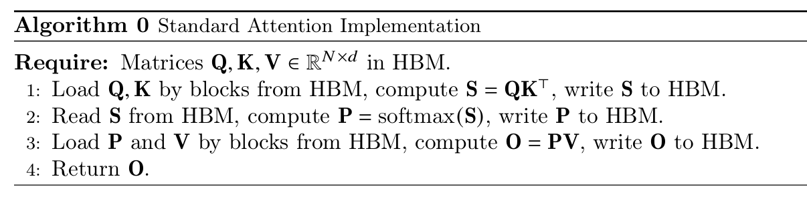
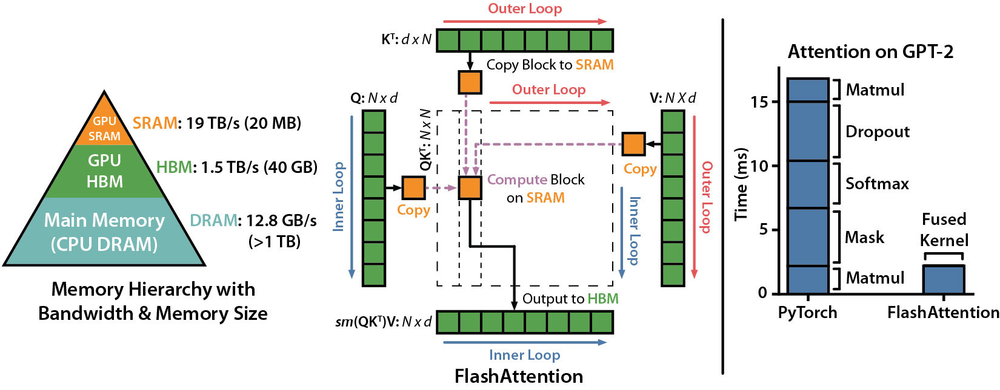
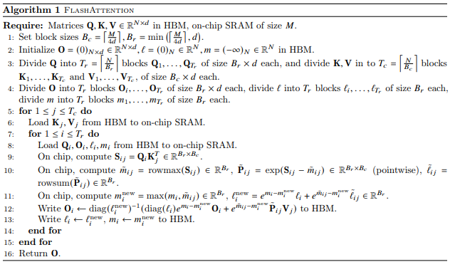

# Project 4: Parallel Programming with FlashAttention

### This project weights 12.5% for your final grade (4 Projects for 50%)

### Release Date:

December 1st, Monday, 2025 (Beijing Time, UTC+08:00)

### Deadline:

11:59 P.M., December 23th, Tuesday, 2025 (Beijing Time, UTC+08:00)

### TA/USTF In Charge of This Assignment

**Mr. Li Mohan** for Code Skeleton Implementation (mohanli1@link.cuhk.edu.cn)

**Mr. Liu Yuxuan** for Grading (yuxuanliu1@link.cuhk.edu.cn)

## Prologue

In this project, you will have the opportunity to gain insight and practice in using CUDA & Triton to accelerate key algorithms in modern machine learning. Specifically, you will implement flash attention algorithm, a high-performance attention mechanism used in large language model. 

First, you will need to learn how to use CUDA and Triton, refer to the documentation and the provided matrix multiplication examples, and implement a simple softmax method. Then, you will need to understand the basic principles and algorithms of flash attention. 

Finally, you need to implement flash attention v1 and optimize it for sparse matrices.

**REMIND: Please start ASAP to avoid the peak period of cluster job submission.**

## Background: Attention is All You NEED!

Every beginner to AI and LLM must have heard this famous saying *"Attention is All You Need"*. This paper proposed the cutting-edge neural network architecture named *transformer* for natural language processing (NLP). It revolutionized sequence modeling by its attention mechanism, and it has received over 200K citations on Google Scholar.

Different from LSTM (Long-Short Term Memory) and RNN (Recurrent Neural Network), which use recurrence and convolution to capture limited surronding context, attention can capture the whole input context and know which part is important to itself through self-attention computation.

A standard way of attention computation is illustrated as follows:

{:height="50%" width="50%"}



**The idea of FlashAttention then comes up with the following two questions:**
1. From project 2 matrix multiply, we know that tiling can improve performance greatly. Attention is done with several matrix operations. Can we use tiling to improve its cache locality and memory utilization?
2. Is it necessary to store intermediate results to HBM so many times? Can we do some computations in one time and reduce the times to store them to HBM and load them back?

Online tutorials for reference:
- [In Chinese] https://transformers.run/c1/attention/#
- [In English] https://jalammar.github.io/illustrated-transformer/
- Paper: Attention is All You Need: https://proceedings.neurips.cc/paper/2017/file/3f5ee243547dee91fbd053c1c4a845aa-Paper.pdf

## Task-0: Project Setup

get project4 from github

The structure of working directory should look like below:

```tree
.
├── README.md
├── assets
│   ├── flash_attention.png
│   ├── part3_sparse_matrix.png
│   └── flash_attention_algorithm.png
├── scripts
│   ├── sbatch_Part1.sh
│   ├── sbatch_Part2.sh
│   └── sbatch_Part3.sh
├── part1_softmax_and_vector_add
│   ├── cuda_softmax.cu
│   ├── triton_softmax.py
│   └── triton_vector_addtion.py
├── part2_flash_attention
│   └── triton_part.py
└── part3_sparse_flash_attention
    └── triton_part.py
```
## Task-1: Softmax with CUDA and Trion

In this section, you will attempt to implement a high-performance softmax function using Triton, a crucial component in attention calculations.

We have also provided some code from the Triton official website for your reference. (triton_vector_addtion.py)

Building upon the standard softmax function, you'll need to add a mask implementation. For more information, please refer to triton-lang.org. The key is to understand how to effectively manage the performance of Triton and the GPU.

Simultaneously, you'll also need to implement a CUDA version of the same softmax function. Both functions must meet baseline requirements.

#### Standard Softmax Formulation

Softmax is a function that maps a real vector to a probability distribution, commonly used in classification and attention mechanisms.

Definition: Given a vector $\large \mathbf{z} = (z_1,\dots,z_n)$, softmax is defined as:

$\large \mathrm{softmax}(z)i = \frac{e^{z_i}}{\sum{j=1}^{n} e^{z_j}}, \quad i=1,\dots,n$

Its output satisfies:

$\large \sum_{i=1}^{n}\mathrm{softmax}(z)_i = 1,\quad \mathrm{softmax}(z)_i \in (0, 1)$

For Triton implementation of Softmax, You can refer to:
- https://triton-lang.org/main/index.html

### Base on the standard softmax, We add some common changes in real applications.

#### Adding Numerical Stability with $-\max(z)$:

$\large \mathrm{softmax}(z)_i = \frac{e^{z_i - \max(z)}}{\sum_{j=1}^{n} e^{z_j - \max(z)}}$

Avoids numerical overflow caused by large $z_i$ (e.g., $e^{50}$ exceeds float32 limits). Subtracting $\max(z)$ keeps exponents non-positive, ensuring stable computation without changing the final probability distribution.

#### Adding Scaling 

$\large \mathrm{softmax}(\text{scale}(z))_i = \frac{e^{s \cdot z_i - \max(s \cdot z)}}{\sum_{j=1}^{n} e^{s \cdot z_j - \max(s \cdot z)}}$ (where $s$ is the scale factor)

Critical for attention mechanisms (e.g., $s = 1/\sqrt{d_k}$). Mitigates overly peaked softmax outputs caused by large dot-product values, preserving gradient flow for training.

#### Adding Dropout 
$\large \text{dropout}(\text{softmax}(z))_i = \begin{cases} \frac{\text{softmax}(z)_i}{1-p} & \text{with probability } 1-p, \\ 0 & \text{with probability } p \end{cases}$ (where $p$ is dropout rate)

Prevents overfitting by randomly zeroing out a fraction of outputs. Scaling surviving elements by $1/(1-p)$ preserves the expected value of the output.

#### Adding Masking 

$\large \text{mask}(z)_i = z_i \cdot m_i + (1 - m_i) \cdot (-\infty)$ (where $m_i \in \{0,1\}$ is the binary mask, $1=$ valid, $0=$ invalid)

Ignores invalid positions (e.g., padding tokens, future tokens in autoregressive models). Invalid positions are set to $-\infty$ (so $e^{-\infty}=0$) and excluded from the softmax sum

## Task-2: FlashAttention with Triton

For reference:
- Link of FlashAttention-v1 paper: https://arxiv.org/abs/2205.14135
- Link of its GitHub repo: https://github.com/Dao-AILab/flash-attention

In this part, you've already gained a basic understanding of Triton. You will now learn flash-attention, an algorithm that accelerates attention computation through parallelism, and implement it using Triton to achieve a baseline.

#### FlashAttention mainly optimizes attention computation from two perspectives
**1. Tiling**
  - Split the input into blocks and make several passes over input blocks
  - Small blocks can fit in GPU SRAM for fast data access like in Project 2

**2. Recomputation**
  - Perform many computations in a time the block is loaded, avoiding storing intermediate results in HBM.
  - Compute softmax in blocks requires numerical compensation.

The core of the flash-attention algorithm lies in reducing MAC (Macro-Macro-Memory) operations. For high-performance GPUs, memory access speeds are shown in the diagram below. SRAM has the fastest access speed but limited space. Frequent reads and writes from HBM (Hardware Memory) will cause significant performance degradation. The flash-attention algorithm reduces unnecessary reads and writes to HBM by optimizing the traditional softmax algorithm through block partitioning.



This assignment requires implementing flash-attention version 1, with a focus on understanding the advantages of block-based computation.

Basic attention calculation:

Attention score calculation: $S_i = Q_iK_i^T$

Numerically stable attention: $p_{ij} = \frac{e^{s_{ij} - \max(s_i)}}{\sum e^{s_{ik} - \max(s_i)}}$

Final output: $O_i = P_iV_i$



## Task-3: Sparse FlashAttention

FlashAttention v1 achieves efficient dense attention computation through tiled and recomputation optimizations. In practical tasks, the attention matrix often exhibits structured sparseness. This necessitates specifying non-zero interaction regions using `mask_ptr` (mask pointer) to further reduce invalid computations and memory overhead. This ensures that the zero-interaction regions specified by the mask are correctly skipped while maintaining the original IO optimization advantages of FlashAttention, while simultaneously verifying performance and correctness.


Since this course focuses on parallel computing, we will provide a simple sparse matrix implementation; you just need to pass it to your kernel function and process it.

## Extra Credit:

Optimizing attention computation is a hot topic. What we did in the three tasks are only about the first version of flash-attention paper. Here are some options for you for further optimization and training:

### Option-1: FlashAttention in CUDA

- implement flash attention version 1 using cuda
- compare the tiling implementations between CUDA and Triton. This will give you an intuitive idea of how Triton was proposed to make CUDA programmers' lives easier.

### Option-2: FlashAttention Ver.2 in Triton

- Read the article and implement flash attention version 2
- Link of article: https://tridao.me/publications/flash2/flash2.pdf

### Option-3: Multi-Head FlashAttention

- Performing attention on the whole input sequence uses a single (Q,K,V) triple, and it will pay too much attention to words identical to itself in the context. As a solution, recent researchers have proposed multi-head attention, simply dividing the input sequence into several parts and performing attention to each part with different (Q,K,V) triples.
- You may implement multi-head attention with FlashAttention optimization.
- Reference:
  - https://colab.research.google.com/github/phlippe/uvadlc_notebooks/blob/master/docs/tutorial_notebooks/tutorial6/Transformers_and_MHAttention.ipynb
  - [In Chinese] https://transformers.run/c1/attention/#multi-head-attention


## How to Execute the Program

#### Job Submission
Please submit the job with sbatch.sh through sbatch.
```
cd /path/to/project4/
sbatch ./scripts/sbatch_Part1.sh
```
## Baseline
### Part1

When seq_len is low, you need to achieve approximate performance, while when seq_len is high, you need to achieve **2x** performance.

The performance of the basic softmax implementation of Triton is similar to that of Torch. You need to analyze in the report why adding softmax operations such as scaling and masking will improve Triton's performance.

| matrix ( seq_len * 4096 ) | cuda | triton   | torch    | native_softmax |
| ------------------------- | ---- | -------- | -------- | -------------- |
| 64                        | N/A  | 0.219897 | 0.092340 | 0.181889       |
| 128                       | N/A  | 0.161582 | 0.096233 | 0.185031       |
| 256                       | N/A  | 0.259864 | 0.133024 | 0.209217       |
| 512                       | N/A  | 0.164272 | 0.227231 | 0.384761       |
| 1024                      | N/A  | 0.213124 | 0.431139 | 0.715254       |
| 2048                      | N/A  | 0.430722 | 0.845140 | 1.372665       |
| 4096                      | N/A  | 0.835523 | 1.672786 | 2.687862       |
| 8192                      | 3    | 1.552750 | 3.198960 | 5.319086       |

### Part2

Baseline 

**flash attention**
| seq_len | d=64      | d=128     | d=256      |
|---------|-----------|-----------|------------|
| 4.0     | 0.047417  | 0.073546  | 0.013213   |​
| 8.0     | 0.030806  | 0.045233  | 0.010536   |​
| 16.0    | 0.031287  | 0.031397  | 0.011197   |​
| 32.0    | 0.031583  | 0.031957  | 0.018482   |​
| 64.0    | 0.032176  | 0.049226  | 0.032983   |​
| 128.0   | 0.049075  | 0.084093  | 0.061418   |​
| 256.0   | 0.081202  | 0.150419  | 0.119085   |​
| 512.0   | 0.146239  | 0.286280  | 0.376478   |​
| 1024.0  | 0.281342  | 0.564162  | 1.494545   |​
| 2048.0  | 0.700489  | 1.722521  | 6.005468   |​
| 4096.0  | 2.797693  | 6.861630  | 23.11792   |


**native**
| seq_len | d=64      | d=128     | d=256      |
|---------|-----------|-----------|------------|
| 4.0     | 0.009248  | 0.012240  | 0.012729   |
| 8.0     | 0.010036  | 0.013029  | 0.013855   |
| 16.0    | 0.010070  | 0.013433  | 0.014463   |
| 32.0    | 0.014198  | 0.015706  | 0.017729   |
| 64.0    | 0.014217  | 0.015931  | 0.019132   |
| 128.0   | 0.017816  | 0.017692  | 0.021165   |
| 256.0   | 0.020526  | 0.023954  | 0.038891   |
| 512.0   | 0.033809  | 0.043338  | 0.065911   |
| 1024.0  | 0.102253  | 0.150740  | 0.226200   |
| 2048.0  | 0.390623  | 0.547616  | 0.896383   |
| 4096.0  | 1.551258  | 2.235741  | 3.652601   |

Due to the shared memory limit in our cluster, the performance of flash attention may not be so fast, but if you run on a better GPU, you will find that flash attention provides a significant performance boost in long sequences. In your report, you also need to anlysis this.

### Part3

| seq_len | d=64      | d=128     | d=256      |
|---------|-----------|-----------|------------|
| 128.0   | 0.079643  | 0.117621  | 0.047131   |
| 256.0   | 0.087517  | 0.083728  | 0.041307   |
| 512.0   | 0.079502  | 0.101411  | 0.077054   |
| 1024.0  | 0.097784  | 0.118791  | 0.176592   |
| 2048.0  | 0.134335  | 0.195731  | 0.411691   |
| 4096.0  | 0.299476  | 0.453869  | 0.972254   |

## Requirements & Grading Policy

- **Implementation (60%)**
  
  - *Task1: Softmax (20%)*
    - *1.1 CUDA Part (10%)*
    - *1.2 Triton Part (10%)*
  - *Task2: Flash Attention (20%)*
  - *Task3: Flash Attention with Sparse matrix (20%)*

  Your programs should be able to compile & execute to get the expected computation result to get the full grade in this part.
  
- **Performance of Your Program (20%)**

  - 5% for Task 1
    - 2.5% for 1.1
    - 2.5% for 1.2
  - 10% for Task 2
  - 5% for Task 3

  Try your best to do optimization on your parallel programs for higher speedup. If your programs show similar performance to the baseline performance, then you can get the full mark for this part. Points will be deducted if your parallel programs perform poorly while no justification can be found in the report.

- **One Report in PDF (20%, No Page Limit)**

  - **Regular Report (10%)**
    The report does not have to be very long and beautiful to help you get a good grade, but you need to include what you have done and what you have learned in this project. The following components should be included in the report:
    - How to compile and execute your program to get the expected output on the cluster.
    - Explain clearly how you designed and implemented each algorithm
    - Show the experiment results you get, and do some numerical analysis, such as calculating the speedup and efficiency, demonstrated with tables and figures.
    - What kinds of optimizations have you tried to speed up your parallel program, and how do they work?
    - Any interesting discoveries you found during the experiment?
  
  - **Analyze performance (10%)**
    - You need to analyze the performance of Triton for each part, including the difference in memory read/write operations between the Triton implementation and Torch.
    - Answer the question: How do you select your *blockSize* and why these make your program performantly.

- **Extra Credits (Max 10%)**
  Extra optimizations or interesting discoveries in the first three tasks may also earn you some extra credits.

  Please write what you do for Extra Credits **in your report**!

### The Extra Credit Policy

According to the professor, the extra credits in this project cannot be added to other projects to make them full marks. The credits are the honor you received from the professor and the teaching staff, and the professor may help raise you to a higher grade level if you are at the boundary of two grade levels and he thinks you deserve a better grade with your extra credits. For example, if you are among the top students with B+ grade, and get enough extra credits, the professor may raise you to A- grade. Furthermore, the professor will invite a few students with high extra credits to have dinner with him.

### Grading Policy for Late Submission

1. late submission for less than 10 minutes after the DDL is tolerated for possible issues during submission.
2. 10 Points deduction for each day after the DDL (11 minutes late will be considered as one day, so be careful)
3. Zero points if you submitted your project late for more than two days
If you have some special reasons for late submission, please send an email to the professor and cc TA Liu Yuxuan.

### File Structure to Submit on BlackBoard

Do not upload build file, bash file and dataset.

Only Code and Report Needed!

```bash
<Your StudentID>.pdf  # Report
<Your StudentID>.zip  # Codes
├── README.md
├── part1_softmax_and_vector_add
│   ├── cuda_softmax.cu
│   ├── triton_softmax.py
│   └── triton_vector_addtion.py
├── part2_flash_attention
│   └── triton_part.py
├── part3_sparse_flash_attention
│   └── triton_part.py    
└── extra (If needed)
    ├── flash_attention.cu
    └── flash_attention_v2.py
```